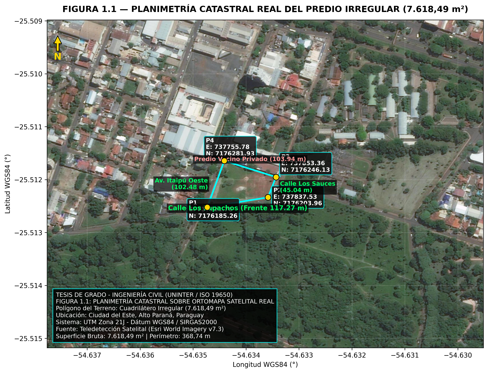
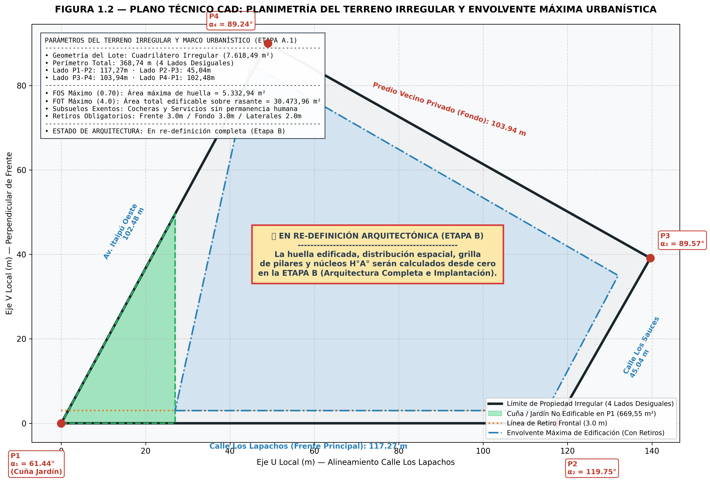
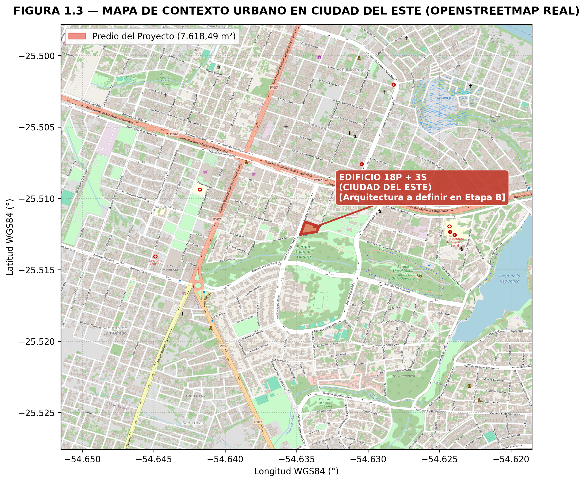

# A.1 — Formalización del Terreno

> **Etapa A › Sub-etapa 1** · **Tareas:** 4 · **Estado:** ✅ Completado
> Normativa: MCDE ([Ord. 011/1994](visor_ordenanzas.html?id=3146), [Ord. M. 003/2026](visor_ordenanzas.html?id=3693), [Ord. 027/2022](visor_ordenanzas.html?id=2725), [Ord. 030/2020](visor_ordenanzas.html?id=2462), [Ord. 005/1976](visor_ordenanzas.html?id=3118)) · Ley de Mensura N° 1083/1985 · NOMENCLATURA.md

---

## 📋 SECCIÓN 1 — GESTIÓN Y TRABAJO

### Checklist de tareas

- [x] **eA-1** · **Planimetría del polígono real con coordenadas UTM**
  - Trazar el polígono de cuadrilátero irregular: P1(737721.76, 7176185.26) → P2(737837.53, 7176203.96) → P3(737853.36, 7176246.13) → P4(737755.78, 7176281.93)
  - Coordenadas extraídas mediante teledetección y digitalización satelital (Google Earth Pro v7.3, UTM Zona 21J WGS84/SIRGAS2000)
  - Calcular área exacta (7.618,49 m²) por método de Gauss/Shoelace
  - Verificar cierre de poligonal ($e_L = 0,00$ m, suma de ángulos interiores = 360,00°)
  - Generar Ortomapa Satelital Real: `etapas/img/figura_1_1_planimetria_satelital_utm.png`
  - Archivo de referencia: `05_RECURSOS/05.05_Scripts_Python/01_Geometria_Terreno/generar_figuras_terreno.py` · `NOMENCLATURA.md`

- [x] **eA-2** · **Identificación de calles y orientación geográfica**
  - Frente principal P1→P2 (117,27 m) sobre **Calle Los Lapachos** (Azimut 80,82°, Rumbo N 80°49' E)
  - Frente secundario P2→P3 (45,04 m) sobre **Calle Los Sauces** (Azimut 20,58°, Rumbo N 20°35' E)
  - Lindero posterior P3→P4 (103,94 m) lindante con **inmueble residencial privado unifamiliar** (predio vecino de dominio particular)
  - Frente secundario / lindero lateral P4→P1 (102,48 m) sobre **Avenida Itaipú Oeste** (Azimut 199,39°, Rumbo S 19°23' W)
  - Determinar Norte verdadero vs. Norte magnético (declinación magnética en CDE = -13,8° W ≈ -14°)
  - Generar Mapa de Contexto Urbano Real (OpenStreetMap): `etapas/img/figura_1_3_mapa_contexto_osm.png`

- [x] **eA-3** · **Análisis del vértice agudo P1 (61,44°) y definición de la cuña**
  - Demarcar la zona no edificable en la esquina de intersección entre Av. Itaipú Oeste y Calle Los Lapachos ($\alpha_1 = 61,44°$)
  - Cuña frontal no edificable de 669,55 m² ($u = 27,00$ m de base y $h = 49,60$ m de altura perpendicular) destinada a plaza seca de acceso peatonal, control de acceso y jardín ornamental sustentable
  - ⚠️ La distribución arquitectónica, huella del edificio y grilla estructural serán calculadas desde cero en la **Etapa B (Arquitectura Completa)**
  - Generar Plano Técnico CAD de Implantación Urbana y Envolvente: `etapas/img/figura_1_2_rectangulo_edificable_cuña.png`

- [x] **eA-4** · **Certificado de uso de suelo y normativa municipal**
  - FOS = 0,70 → área máxima de huella edificable = 5.332,94 m²
  - FOT = 4,0 → área total construible sobre rasante = 30.473,96 m²
  - Subsuelos exentos del cómputo FOT según ordenanza municipal de CDE
  - Retiros obligatorios adoptados: Frente 3,0 m, Fondo 3,0 m, Laterales 2,0 m c/u

### Decisiones tomadas

| Fecha | Decisión | Fundamento |
|---|---|---|
| 2026-09-19 | Origen de Coordenadas UTM | Teledetección Satelital (Google Earth Pro v7.3, UTM 21J WGS84) — Hipótesis de anteproyecto |
| 2026-09-19 | Nomenclatura Vial y Colindancias | P1-P2: Calle Los Lapachos · P2-P3: Calle Los Sauces · P3-P4: Inmueble Residencial Privado · P4-P1: Av. Itaipú Oeste |
| 2026-09-19 | Retiros adoptados: 3,0 m frente / 3,0 m fondo / 2,0 m laterales | Hipótesis urbanística formal para definir la envolvente máxima |
| 2026-09-19 | FOS = 0,70 / FOT = 4,0 (Huella máx. 5.332,94 m² / Área total 30.473,96 m²) | Marco legal urbanístico de CDE ([Ord. 011/1994](visor_ordenanzas.html?id=3146) y [Ord. M. 003/2026](visor_ordenanzas.html?id=3693)) |
| 2026-09-19 | Re-definición Arquitectónica | La arquitectura, plantas tipo, huella y grilla se diseñarán desde cero en la **Etapa B** |
| 2026-09-19 | Destino de cuña aguda P1 (669,55 m²) | Plaza seca de acceso peatonal, control de acceso y paisajismo ambiental |

### Archivos de referencia y figuras generadas

| Archivo | Descripción | Estado |
|---|---|---|
| `00_GESTION_DE_PROYECTO/NOMENCLATURA.md` | Convención de nombres CDE / ISO 19650 | Existente |
| `05_RECURSOS/05.05_Scripts_Python/01_Geometria_Terreno/geometria_terreno.py` | Script Python de verificación geométrica del predio | Creado / Verificado |
| `05_RECURSOS/05.05_Scripts_Python/01_Geometria_Terreno/generar_figuras_terreno.py` | Script Python generador de mapas y planos CAD con datos reales | Creado / Verificado |
| `07_KNOWLEDGE_BASE/07.04_Normativa_Resumen/Normativa_Urbanistica_CDE_Planimetria_UTM_v01.md` | Documento técnico de base de conocimiento CDE | Creado / Verificado |
| `etapas/img/figura_1_1_planimetria_satelital_utm.png` | Figura 1.1: Ortomapa Satelital Real Esri + Polígono UTM 21J | Generado |
| `etapas/img/figura_1_2_rectangulo_edificable_cuña.png` | Figura 1.2: Plano Técnico CAD de Terreno Irregular y Envolvente Urbanística | Generado |
| `etapas/img/figura_1_3_mapa_contexto_osm.png` | Figura 1.3: Mapa de Contexto Urbano OpenStreetMap (OSM) | Generado |

---

## 📝 SECCIÓN 2 — BORRADOR ACADÉMICO

### 1.1 Descripción del predio, planimetría y metodología de relevamiento

El terreno objeto de estudio se ubica en la zona urbana de **Ciudad del Este**, departamento de Alto Paraná, República del Paraguay. Las coordenadas cartesianas de los vértices del predio fueron obtenidas mediante **técnicas de teledetección y digitalización sobre ortofotos satelitales (Google Earth Pro v7.3)** referenciadas al sistema geodésico **UTM Zona 21J, dátum WGS84 / SIRGAS2000**, resultando en la planimetría catastral tabulada a continuación:

| Vértice | Este X (m) | Norte Y (m) | Lado | Longitud (m) | Azimut Norte (°) | Denominación de Vía Pública / Lindero Predial |
|---|---|---|---|---|---|---|
| **P1** | 737.721,76 | 7.176.185,26 | P1 → P2 | 117,271 | 80,82° | **Calle Los Lapachos** (Frente Principal N 80°49' E) |
| **P2** | 737.837,53 | 7.176.203,96 | P2 → P3 | 45,043 | 20,58° | **Calle Los Sauces** (Frente Secundario N 20°35' E) |
| **P3** | 737.853,36 | 7.176.246,13 | P3 → P4 | 103,940 | 290,15° | **Inmueble Residencial Privado** (Lindero Posterior / Predio Vecino) |
| **P4** | 737.755,78 | 7.176.281,93 | P4 → P1 | 102,481 | 199,39° | **Avenida Itaipú Oeste** (Frente Secundario S 19°23' W) |

#### Consideración metodológica sobre la precisión planimétrica

> **Nota técnica de tesis:** Las coordenadas UTM de los puntos P1 a P4 no fueron relevadas mediante una mensura geodésica directa con equipos GNSS diferencial (RTK/Estación Total) en campo, sino mediante la extracción vectorizada sobre imágenes satelitales en Google Earth Pro. Para fines del anteproyecto académico de tesis de grado, este nivel de precisión planimétrica (con una incertidumbre posicional relativa estimada entre $\pm 1,5\text{ m}$ y $\pm 2,5\text{ m}$) resulta plenamente adecuado para la delimitación del polígono edificable. Se deja constancia de que, para la fase ejecutiva de construcción del proyecto, se requerirá un relevamiento topográfico perimetral definitivo a cargo de un perito agrimensor matriculado, en cumplimiento de la Ley N° 1083/1985 de Mensura y Procedimiento Catastral del Paraguay.

El predio presenta una **geometría irregular correspondiente a un cuadrilátero de cuatro lados desiguales**. El área bruta del predio calculada mediante el método de Gauss (algoritmo de Shoelace) resulta en **7.618,49 m²**, con un perímetro total de **368,74 m**. El frente principal se extiende a lo largo de la **Calle Los Lapachos** (tramo P1→P2) con **117,27 m** de desarrollo lineal. El frente secundario de **45,04 m** (tramo P2→P3) linda sobre la **Calle Los Sauces**, mientras que el lindero lateral/frente secundario de **102,48 m** (tramo P4→P1) limita con la **Avenida Itaipú Oeste**. El lindero posterior de **103,94 m** (tramo P3→P4) colinda directamente con un **inmueble unifamiliar residencial de dominio privado** (predio vecino).

La declinación magnética local en Ciudad del Este se determina en **-13,8° W**, lo que implica una rotación de 13,8° al Oeste entre el Norte magnético y el Norte verdadero.

#### Restricción geométrica — vértice agudo P1 (Intersección Av. Itaipú Oeste y Calle Los Lapachos)

El análisis de los ángulos interiores del polígono irregular revela la siguiente configuración geométrica:
- Ángulo en P1: $\alpha_1 = 61,44^\circ$ ($61,4365^\circ$) $\to$ Intersección Av. Itaipú Oeste / Calle Los Lapachos (Vértice Agudo)
- Ángulo en P2: $\alpha_2 = 119,75^\circ$ ($119,7510^\circ$) $\to$ Intersección Calle Los Lapachos / Calle Los Sauces (Vértice Obtuso)
- Ángulo en P3: $\alpha_3 = 89,57^\circ$ ($89,5716^\circ$) $\to$ Esquina Calle Los Sauces / Lindero Privado Vecino
- Ángulo en P4: $\alpha_4 = 89,24^\circ$ ($89,2409^\circ$) $\to$ Esquina Lindero Privado Vecino / Av. Itaipú Oeste
- Suma total de ángulos interiores: $360,00^\circ$ (Cierre teórico exacto).

El vértice P1 presenta un **ángulo interior agudo de 61,44°**. Esta condición geométrica en la esquina de la Av. Itaipú Oeste y Calle Los Lapachos impide proyectar estructuras hasta esa esquina. La zona triangular resultante de **669,55 m²** (cuña frontal de $u = 27,00\text{ m}$ de base sobre Calle Los Lapachos y $h = 49,60\text{ m}$ de altura perpendicular) se destina formalmente a:
- Acceso peatonal principal y plaza seca de recepción desde la vía pública
- Jardín de borde ornamental y arbolado nativo de amortiguación ambiental
- Chaflán arquitectónico de fachada y control de accesos

> 🔒 **Aviso de alcance arquitectónico:** La implantación de la edificación, el diseño formal del edificio, las plantas tipológicas y la grilla de pilares se encuentran en proceso de **re-definición completa desde cero en la Etapa B (Arquitectura Completa)**. En esta Sub-etapa A.1 se formaliza exclusivamente el polígono del terreno irregular y la envolvente urbanística máxima permitida.

### 1.2 Parámetros urbanísticos y uso del suelo

De acuerdo con el cuerpo legal urbanístico de la Municipalidad de Ciudad del Este ([Ord. 011/1994 J.M.](visor_ordenanzas.html?id=3146), [Ord. M. 003/2026 J.M.](visor_ordenanzas.html?id=3693), [Ord. 027/2022 J.M.](visor_ordenanzas.html?id=2725) y [Ord. 005/1976 J.M.](visor_ordenanzas.html?id=3118)), los indicadores urbanísticos aplicables a la parcela son:

| Indicador | Valor Normativo / Adoptado | Estado de Cumplimiento | Observación / Fundamento |
|---|---|---|---|
| **Factor de Ocupación del Suelo (FOS)** | 0,70 (70,00%) | ✅ Límite Normativo | Área máx. de huella edificable = $5.332,94\text{ m}^2$. |
| **Factor de Ocupación Total (FOT)** | 4,0 | ⚠️ Límite Normativo | Área máx. construible sobre rasante = $30.473,96\text{ m}^2$. |
| **Retiro frontal** | 3,0 m | ✅ Adoptado | Sobre el frente Calle Los Lapachos ($117,27\text{ m}$). |
| **Retiro de fondo** | 3,0 m | ✅ Adoptado | Sobre el lindero del inmueble privado residencial ($103,94\text{ m}$). |
| **Retiros laterales** | 2,0 m c/u | ✅ Adoptado | Sobre Calle Los Sauces ($45,04\text{ m}$) y Av. Itaipú Oeste ($102,48\text{ m}$). |
| **Altura máxima** | Sin restricción de altura | ✅ Conforme | Sujeto a plano de gálibo e iluminación según ordenanza CDE. |

> **Nota de gestión urbanística:** Los subsuelos de cocheras y servicios sin permanencia humana se encuentran exentos del cómputo de FOT según la ordenanza municipal de Ciudad del Este. La definición exacta del área edificada y su ajuste ante los límites de FOS y FOT serán verificados tras el desarrollo de los anteproyectos arquitectónicos en la Etapa B.

---

### Referencias bibliográficas — A.1

- Municipalidad de Ciudad del Este — *Reglamentación del Uso del Suelo, Zonificación y Edificaciones* ([Ordenanza N° 011/1994](visor_ordenanzas.html?id=3146), [Ordenanza N° M. 003/2026](visor_ordenanzas.html?id=3693), [Ordenanza N° 027/2022](visor_ordenanzas.html?id=2725) y [Ordenanza N° 005/1976](visor_ordenanzas.html?id=3118)), CDE, Paraguay.
- Municipalidad de Ciudad del Este — *Instalaciones Sanitarias y Tratamiento de Efluentes PTAR* ([Ordenanza N° 030/2020 J.M.](visor_ordenanzas.html?id=2462) y [Ordenanza N° 033/2023 J.M.](visor_ordenanzas.html?id=2849)), CDE, Paraguay.
- Dirección del Servicio Geográfico Militar (DISERGEMIL / IGM) — *Red Geodésica Nacional y Sistema de Referencia SIRGAS2000 / WGS84*, Asunción, Paraguay.
- Ley N° 1083/1985 — *Ley de Mensura y Procedimiento Catastral de la República del Paraguay*.
- Google LLC — *Google Earth Pro v7.3 Satellite Imaging & Geographic Data*, Mountain View, CA.
- OpenStreetMap Contributors — *OpenStreetMap Vector Tile Mapping Services*, CDE, Paraguay.
- INTN — Instituto Nacional de Tecnología y Normalización: Normativa Técnica Paraguaya.
