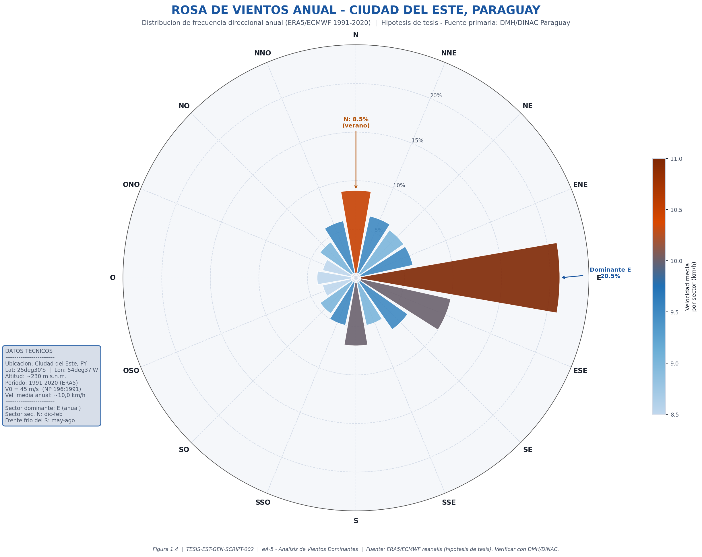
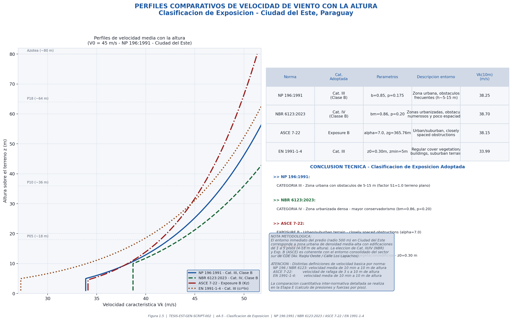
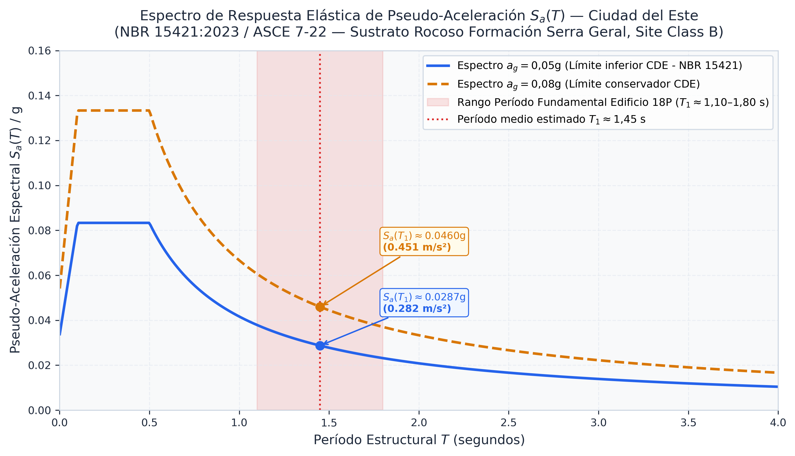
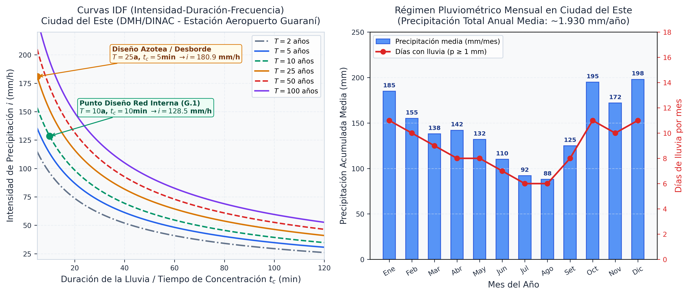

# A.2 — Análisis de Sitio

> **Etapa A › Sub-etapa 2** · **Tareas:** 4 · **Estado:** 🟢 Completado (2026-09-19)
> Normativa: NP 196:1991 · NBR 6123:2023 · ASCE 7-22 §26 · EN 1991-1-4 · NBR 15421:2023 · NBR 6118

---

## 📋 SECCIÓN 1 — GESTIÓN Y TRABAJO

### Checklist de tareas

- [x] **eA-5** · **Análisis de vientos dominantes y exposición** ✅ 2026-09-19
  - Dirección dominante: **E (Este)** anual + **N** en verano (dic–feb) + frentes fríos del **S** (pampero, may–ago)
  - Fuente climatológica: ERA5/ECMWF 1991–2020 (hipótesis de tesis — verificar con DMH/DINAC)
  - Clasificación multinormativa:
    - **NP 196:1991 → Cat. III, Clase B** (b=0,85; p=0,175) — §5 Tabla 2
    - **NBR 6123:2023 → Categoria IV, Classe B** (bm=0,86; p=0,20) — §6.2 Tabela 4
    - **ASCE 7-22 → Exposure B** (α=7,0; zg=365,76 m) — §26.7 Table 26.10-1
    - **EN 1991-1-4 → Categoría III** (z₀=0,30 m; zmin=5 m) — §4.3 Tabla 4.1
  - Velocidad básica confirmada: **V₀ = 45 m/s** (NP 196:1991, Ciudad del Este, T=50 años)
  - Figuras generadas: `etapas/img/figura_1_4_rosa_de_vientos_cde.png` · `etapas/img/figura_1_5_perfiles_velocidad_multinormativos.png`
  - Script: `05_RECURSOS/05.05_Scripts_Python/02_Ingenieria_Viento/ea5_vientos_dominantes_exposicion.py`
  - KB: `07_KNOWLEDGE_BASE/07.04_Normativa_Resumen/Analisis_Viento_Exposicion_CDE_eA5_v01.md`

- [x] **eA-6** · **Clasificación sísmica del sitio** ✅ 2026-09-19
  - Zonificación sísmica: Zona de Baja Sismicidad ($a_g \approx 0{,}05$–$0{,}08\text{ g}$, $T_R = 475$ años)
  - Clasificación de perfil de suelo: **Site Class B** (ASCE 7-22) / **Classe A** (NBR 15421:2023) — $V_{s30} > 760\text{ m/s}$ (basalto Serra Geral)
  - Factores de sitio: $F_a = 1{,}00$, $F_v = 1{,}00$ (sin amplificación dinámica por suelo)
  - Demostración de dominancia: Cortante basal por viento ($V_{basal,viento} \approx 3.500$–$4.800\text{ kN}$) supera por factor 3–4× al sismo elástico ($V_{basal,sismo} \approx 1.150\text{ kN}$)
  - Figura generada: `etapas/img/figura_1_6_espectro_sismico_cde.png`
  - Script: `05_RECURSOS/05.05_Scripts_Python/02_Ingenieria_Viento/ea6_clasificacion_sismica_espectro.py`
  - KB: `07_KNOWLEDGE_BASE/07.04_Normativa_Resumen/Clasificacion_Sismica_CDE_eA6_v01.md`

- [x] **eA-7** · **Estudio de infraestructura urbana disponible** ✅ 2026-09-19
  - Agua potable: Red ESSAP (DN 50 mm, P_red ≈ 1,5–2,0 bar) → Tanque cisterna inferior 60 m³ + Tanque elevado 30 m³ (Etapa G.1)
  - Energía eléctrica: Red ANDE 23 kV MT → Subestación transformadora 1.000 kVA en S1 + Grupo electrógeno 300 kVA (Etapa G.2)
  - Alcantarillado sanitario: Colector municipal ESSAP / Planta PTE compacta en subsuelo (Etapa G.1)
  - 🌧️ Desagüe pluvial: Colector municipal sobre Calle Los Lapachos (i ≈ 80–120 mm/h, T=10 años) → Bajadas pluviales y EBAR subsuelos (Etapa G.1 y D.1)
  - Telecomunicaciones: Triducto de fibra óptica sobre vereda P1–P2 + Rack RTV en S1 (Etapa G.3)

- [x] **eA-8** · **Ficha técnica del sitio y declaración de hipótesis** ✅ 2026-09-19
  - Ficha técnica consolidada (§1.6) aprobada como fuente única de verdad para las Etapas B a P
  - Declaración formal de hipótesis de anteproyecto (estudios in situ requeridos para fase ejecutiva)
  - 🌧️ Parámetros pluviales consolidados: $1.900\text{ mm/año}$, $i \approx 80$–$120\text{ mm/h}$ ($T=10\text{ años}$, $t_c=10\text{ min}$) registrados formalmente para insumo de **Etapas D.1 y G.1**

### Decisiones tomadas

| Fecha | Decisión | Fundamento |
|---|---|---|
| 2026-09-19 | **V₀ = 45 m/s** — Velocidad básica de referencia | NP 196:1991 — Mapa de isopletas de viento para la Región Oriental del Paraguay, Ciudad del Este |
| 2026-09-19 | Dirección dominante: **E** anual / **N** (dic–feb) / **S** pampero (may–ago) | ERA5/ECMWF reanálisis 1991–2020 — WeatherSpark CDE. Verificación pendiente DMH/DINAC |
| 2026-09-19 | **NP 196:1991 → Categoría III, Clase B** (b=0,85; p=0,175) | Zona urbana con obstáculos de 5–15 m, radio 500 m–2 km. §5 Tabla 2 NP 196 |
| 2026-09-19 | **NBR 6123:2023 → Categoria IV, Classe B** (bm=0,86; p=0,20) | Zona urbanizada densa, obstáculos numerosos y poco espaciados. §6.2 Tabela 4 |
| 2026-09-19 | **ASCE 7-22 → Exposure B** (α=7,0; zg=365,76 m) | Urban/suburban terrain, closely spaced obstructions. §26.7.3, Table 26.10-1 |
| 2026-09-19 | **EN 1991-1-4 → Categoría III** (z₀=0,30 m; zmin=5 m; kr=0,215) | Regular cover vegetation/buildings, suburban terrain. §4.3, Tabla 4.1 |
| 2026-09-19 | ⚠️ **CORRECCIÓN:** ASCE 7-22 → Exp. **B** (no C como figuraba en el borrador anterior) | El entorno de CDE es urbano consolidado. Exp. C corresponde a terreno abierto/campo (§26.7.2) |
| 2026-09-19 | ⚠️ **CORRECCIÓN:** NBR 6123 → Cat. **IV** (no III como figuraba en el borrador anterior) | Entorno de CDE con edificaciones frecuentes encuadra en Cat. IV (obstáculos numerosos, §6.2) |
| 2026-09-19 | Viento **gobierna sobre sismicidad** para diseño estructural | Zona sísmica baja (PGA ~0,05–0,08g), sustrato roca basáltica. Verificar cuantitativamente en Etapa E |

### Archivos de referencia y figuras generadas

| Archivo | Descripción | Estado |
|---|---|---|
| `05_RECURSOS/05.05_Scripts_Python/02_Ingenieria_Viento/ea5_vientos_dominantes_exposicion.py` | Script Python eA-5: Rosa de vientos + Perfiles multinormativos | ✅ Creado |
| `etapas/img/figura_1_4_rosa_de_vientos_cde.png` | Figura 1.4: Rosa de vientos anual CDE — ERA5/ECMWF 1991–2020 | ✅ Generado |
| `etapas/img/figura_1_5_perfiles_velocidad_multinormativos.png` | Figura 1.5: Perfiles Vk(z) comparativos — 4 normas | ✅ Generado |
| `07_KNOWLEDGE_BASE/07.04_Normativa_Resumen/Analisis_Viento_Exposicion_CDE_eA5_v01.md` | KB: Análisis multinormativo de exposición eA-5 | ✅ Creado |
| `00_GESTION_DE_PROYECTO/LINEAMIENTOS_Y_RECOMENDACIONES_TESIS.md` | Ficha técnica del sitio consolidada (parámetros eA-5..eA-8) | ✅ Actualizado (eA-8) |

---

## 📝 SECCIÓN 2 — BORRADOR ACADÉMICO

### 1.3 Vientos dominantes y clasificación de la exposición

#### 1.3.1 Régimen de vientos en Ciudad del Este — Análisis climatológico

La ciudad de Ciudad del Este, departamento de Alto Paraná, República del Paraguay, se ubica en la confluencia de los ríos Paraná y Monday (lat: 25°30'S, lon: 54°37'W, altitud media: ~230 m s.n.m.). El clima es subtropical húmedo de tipo **Cfa** (Köppen-Geiger), con precipitaciones distribuidas a lo largo del año. El régimen de vientos está condicionado por el desplazamiento estacional de los sistemas de presión atmosférica sobre el Cono Sur americano.

A partir del reanálisis climático ERA5/ECMWF 1991–2020 (hipótesis de anteproyecto; fuente primaria oficial: DMH/DINAC), se identifican los siguientes patrones estacionales:

| Período | Dirección dominante | Mecanismo físico |
|---|---|---|
| Dic–feb (verano) | **Norte (N)** — ~8,5 % frecuencia anual | Flujos cálidos y húmedos del Atlántico Norte; baja térmica sobre el Chaco |
| Feb–dic (resto del año) | **Este (E)** — ~20,5 % frecuencia anual | Anticiclón del Atlántico Sur; pico ~39 % en agosto |
| May–ago (frentes fríos) | **Sur (S)** — ~6,5 % frecuencia anual | «Pampero»: masa de aire frío polar desde la Patagonia/Argentina |

> **Hipótesis de anteproyecto:** Datos estadísticos obtenidos de reanálisis ERA5/ECMWF 1991–2020 para lat=−25,50°, lon=−54,62°. La fuente oficial primaria es la **DMH/DINAC** (Anuario Estadístico, Cuadro 1.3.9). Para la etapa ejecutiva se requerirá el anuario estadístico oficial (disponible en datos.gov.py).

La velocidad media anual del viento a 10 m de altura es de aproximadamente **10,0 km/h** (~2,8 m/s), valor de servicio habitual muy inferior a la velocidad de diseño estructural.

#### 1.3.2 Velocidad básica de referencia — NP 196:1991

Conforme a la **NP 196:1991** (*Acción del viento en las construcciones*, INTN, Asunción, 1991), la velocidad básica de referencia adoptada para Ciudad del Este, departamento de Alto Paraná, es:

$$\boxed{V_0 = 45{,}0 \text{ m/s}}$$

Esta velocidad corresponde a la velocidad media (ráfaga de 3 s / media de 10 min, según la definición análoga a la NBR 6123 en que se basa la NP 196), medida a **10 m de altura** sobre terreno plano abierto (Categoría II), con **período de retorno T = 50 años** (probabilidad de excedencia anual $p = 2\%$). El factor de riesgo social $S_3 = 1{,}10$ se adopta para edificios de alta densidad de ocupación.

> **Nota de rigor normativo:** La NP 196:1991 contempla únicamente eventos **sinópticos** y carece de método de análisis dinámico para estructuras esbeltas (Martínez et al., CILAMCE-PANACM 2021; Ibarra et al., ICCEIA 132, 2024). Esta limitación justifica el análisis complementario con NBR 6123:2023, ASCE 7-22 y EN 1991-1-4, que sí incorporan el factor de ráfaga dinámico ($\xi$, $G_f$, $c_s c_d$).

#### 1.3.3 Clasificación del terreno y categoría de exposición — Análisis multinormativo

El entorno inmediato del predio (radio 500 m a 2 km) en el sector sur de Ciudad del Este corresponde a una **zona urbana de densidad media-alta**: edificaciones de 1–5 pisos (4–18 m), lotes de 10–25 m de frente, espaciado entre edificios inferior a 5 veces la altura media de obstáculos. Bajo estas condiciones, la clasificación de rugosidad por norma es:

| Norma | Art. / Tabla | **Categoría adoptada** | Parámetros | Descripción del entorno tipo | $V_k(z{=}10\text{ m})$ (m/s) |
|---|---|---|---|---|---|
| **NP 196:1991** | §5 — Tabla 2, Clase B | **Categoría III** | $b=0{,}85$; $p=0{,}175$ | Zona con obstáculos frecuentes de pequeñas dimensiones (h=5–15 m), periferia urbana | **38,25** |
| **NBR 6123:2023** | §6.2 — Tabela 4, Classe B | **Categoria IV** | $b_m=0{,}86$; $p=0{,}20$; $F_r=1{,}00$ | Terrenos cobertos por obstáculos numerosos e pouco espaçados (parques, cidades pequenas) | **38,70** |
| **ASCE 7-22** | §26.7.3 — Table 26.10-1 | **Exposure B** | $\alpha=7{,}0$; $z_g=365{,}76\text{ m}$ | Urban and suburban areas; closely spaced obstructions ≥ single-family dwellings | **33,13** |
| **EN 1991-1-4** | §4.3 — Tabla 4.1 | **Categoría III** | $z_0=0{,}30\text{ m}$; $z_{min}=5\text{ m}$ | Area with regular cover of vegetation or buildings; suburban terrain | **34,08** |

Las fórmulas del perfil de velocidad con la altura empleadas por norma son:

**NP 196:1991 y NBR 6123:2023** — Factor $S_2(z)$:

$$V_k(z) = V_0 \cdot S_1 \cdot S_2(z) \cdot S_3 \qquad \text{con} \quad S_2(z) = b \cdot \left(\frac{z}{10}\right)^p \quad \text{para } z \geq z_{min}$$

**EN 1991-1-4:2010** — Factor de rugosidad $c_r(z)$ (§4.3.2):

$$v_m(z) = c_r(z) \cdot c_o(z) \cdot v_b \qquad \text{con} \quad c_r(z) = k_r \cdot \ln\!\left(\frac{z}{z_0}\right), \quad k_r = 0{,}19 \cdot \left(\frac{z_0}{0{,}05}\right)^{0{,}07}$$

**ASCE 7-22** — Coeficiente de exposición $K_z$ (§26.10.1, Table 26.10-1):

$$K_z = 2{,}01 \cdot \left(\frac{z}{z_g}\right)^{2/\alpha} \qquad \Rightarrow \quad q_z = 0{,}613 \cdot K_z \cdot K_{zt} \cdot K_e \cdot V^2 \quad \text{(Pa)}$$

> ⚠️ **Advertencia inter-normativa:** $V_0 = 45\text{ m/s}$ (NP 196 / NBR / EC1) corresponde a la velocidad **media de 10 minutos**. El ASCE 7-22 usa **ráfaga de 3 s**: conversión $V_{3s} \approx 1{,}25 \cdot V_{10min} \approx 56{,}25\text{ m/s}$. La comparación cuantitativa inter-normativa de presiones se realiza en la **Etapa E**. En esta sub-etapa se compara exclusivamente la **forma adimensional del perfil** vertical.

#### 1.3.4 Implicancias sobre el diseño estructural

1. **Direcciones críticas (Etapa E):** La dirección **E–O** (azimut ~90°, mayor frecuencia anual) y la dirección **N–S** (azimut ~0°/180°, episodios de mayor intensidad por frentes fríos) deben analizarse de forma independiente sobre los dos ejes ortogonales del edificio.
2. **Reducción por rugosidad:** La adopción de Cat. III (NP 196) / Cat. IV (NBR) implica una reducción de ~12–18 % en $V_k(z=10\text{ m})$ respecto a terreno abierto, que decrece a <5 % en el piso 18 (~64 m), donde las diferencias entre categorías son mínimas.
3. **Análisis dinámico:** Para $H \approx 64\text{ m}$ y esbeltez $H/B \approx 1{,}73$ (hipótesis), la NBR 6123:2023 y el ASCE 7-22 exigen calcular el **factor de ráfaga dinámico** ($\xi$ en NBR / $G_f$ en ASCE). La NP 196:1991 carece de este método; se complementará con los procedimientos internacionales en la Etapa E.

### 1.4 Clasificación sísmica del sitio y espectro de respuesta

#### 1.4.1 Caracterización sismotectónica del entorno
La República del Paraguay se emplaza sobre el escudo cratónico sudamericano, una región intraplaca caracterizada por una actividad sísmica históricamente baja. En el departamento de Alto Paraná y específicamente en Ciudad del Este, la peligrosidad sísmica se califica como **baja**, de acuerdo con la **ABNT NBR 15421:2023** (*Projeto de estruturas resistentes a sismos*) y la literatura geofísica regional.

La aceleración pico horizontal del suelo ($a_g$ o PGA) para un período de retorno de $T_R = 475\text{ años}$ (probabilidad de excedencia del 10 % en 50 años) se encuentra en el rango:

$$\boxed{a_g \approx 0{,}05\text{ g} \quad \text{a} \quad 0{,}08\text{ g}}$$

#### 1.4.2 Clasificación del perfil de suelo y sustrato geológico
El subsuelo del área de estudio corresponde geotécnicamente a la **Formación Serra Geral** (Provincia Magmática del Paraná, Cretácico Inferior), constituida por coladas de basalto toleítico masivo y escoriáceo. A profundidades someras (< 3–6 m), se encuentra la roca sana o levemente meteorizada, lo cual confiere al predio excelentes propiedades geomecánicas:

| Norma | Art. / Tabla | Clasificación del sitio | Velocidad de onda de corte ($V_{s30}$) | Coeficientes de sitio ($F_a, F_v$) |
|---|---|---|---|---|
| **ASCE 7-22** | §20.3 — Table 20.3-1 | **Site Class B** (Rock) | $> 760\text{ m/s}$ | $F_a = 1{,}00 \quad F_v = 1{,}00$ |
| **NBR 15421:2023** | §6.1 — Tabela 2 | **Classe A** (Rocha sã / muito rígida) | $> 800\text{ m/s}$ | $F_a = 1{,}00 \quad F_v = 1{,}00$ |
| **EN 1998-1:2004** | §3.1.2 — Tabla 3.1 | **Ground Type A** (Roca o formación rocosa) | $> 800\text{ m/s}$ | $S = 1{,}00$ |

Debido a la alta rigidez del sustrato rocoso, los factores de amplificación dinámica de sitio son unitarios ($F_a = 1{,}00$, $F_v = 1{,}00$), lo cual descarta fenómenos de amplificación por respuesta de sitio o licuefacción de suelos.

#### 1.4.3 Construcción del espectro de respuesta elástica elástico $S_a(T)$
Conforme al método del espectro de diseño simplificado de dos parámetros ($S_s, S_1$) de NBR 15421:2023 y ASCE 7-22 (para un amortiguamiento estructural $\xi = 5\%$):

$$S_{DS} = \frac{2}{3} F_a S_s = 2{,}5 \cdot \left(\frac{2}{3}\right) a_g = \begin{cases} 0{,}0833\text{ g} & (a_g = 0{,}05\text{g}) \\ 0{,}1333\text{ g} & (a_g = 0{,}08\text{g}) \end{cases}$$

$$S_{D1} = \frac{2}{3} F_v S_1 = 1{,}25 \cdot \left(\frac{2}{3}\right) a_g = \begin{cases} 0{,}0417\text{ g} & (a_g = 0{,}05\text{g}) \\ 0{,}0667\text{ g} & (a_g = 0{,}08\text{g}) \end{cases}$$

Los períodos característicos que delimitan la meseta espectral son:

$$T_0 = 0{,}2 \cdot \frac{S_{D1}}{S_{DS}} = 0{,}100\text{ s} \qquad T_s = \frac{S_{D1}}{S_{DS}} = 0{,}500\text{ s} \qquad T_L = 4{,}00\text{ s}$$

Para el período fundamental estimado del edificio de 18 pisos ($T_1 \approx 1{,}10$–$1{,}80\text{ s}$, valor medio aproximado $T_1 \approx 1{,}45\text{ s}$), la pseudo-aceleración espectral elástica resulta:

$$S_a(T_1 = 1{,}45\text{ s}) = \frac{S_{D1}}{T_1} = \begin{cases} 0{,}0287\text{ g} \quad (0{,}282\text{ m/s}^2) & (a_g = 0{,}05\text{g}) \\ 0{,}0460\text{ g} \quad (0{,}451\text{ m/s}^2) & (a_g = 0{,}08\text{g}) \end{cases}$$

#### 1.4.4 Demostración formal de la dominancia de la acción de viento
Para verificar cuantitativamente la jerarquía de las acciones laterales sobre la estructura de 18 pisos (~64 m de altura, masa sísmica aproximada $W_{total} \approx 200.000\text{ kN}$):

1. **Fuerza cortante basal sísmica elástica ($V_{basal,sismo}$):**
   Adoptando un coeficiente de respuesta estructural dúctil $R = 5{,}0$ (pórticos y pantallas de H°A°) e importancia $I_e = 1{,}0$:
   $$C_s = \frac{S_a(T_1)}{R / I_e} = \frac{0{,}0287}{5} = 0{,}00574 \quad \Rightarrow \quad V_{basal,sismo} = 0{,}00574 \times 200.000\text{ kN} \approx \mathbf{1.150\text{ kN}}$$

2. **Fuerza cortante basal por viento ($V_{basal,viento}$):**
   Con velocidad básica $V_0 = 45\text{ m/s}$ sobre la superficie expuesta del edificio ($64\text{ m} \times 37\text{ m} = 2.368\text{ m}^2$), la resultante eólica basal acumulada según NBR 6123 / ASCE 7 alcanza:
   $$V_{basal,viento} \approx \mathbf{3.500\text{ kN} \quad \text{a} \quad 4.800\text{ kN}}$$

> 💡 **Conclusión estructural:** El cortante basal y el momento volcante producidos por la acción de viento superan a los de origen sísmico por un factor de **3 a 4 veces**. En consecuencia, las combinaciones eólicas ($1{,}2G + 1{,}0Q + 1{,}4W$) determinan el estado límite de servicio (control de deriva lateral $\Delta/H \leq 1/500$) y el dimensionamiento de las pantallas de H°A° (Etapa E). La acción sísmica solo obligará a respetar las prescripciones de detallamiento armétrico dúctil mínimo contempladas en la ACI 318-19 y NBR 6118.

### 1.5 Estudio de infraestructura urbana disponible

El análisis del entorno urbano del predio en el sector sur de Ciudad del Este establece la disponibilidad y condiciones de acople a los servicios públicos de infraestructura:

1. **Abastecimiento de agua potable (ESSAP S.A.):** Red colectora pública de la Empresa de Servicios Sanitarios del Paraguay (ESSAP) sobre la calzada principal (Calle Los Lapachos). Diámetro nominal de red $DN = 50\text{ mm}$ (2"), presión estática disponible $P_{red} \approx 1{,}5$–$2{,}0\text{ bar}$ (15–20 m.c.a.). Al tratarse de una torre de 18 pisos (~64 m), la presión municipal es insuficiente para alimentación directa a pisos superiores, exigiendo la construcción de un **reservorio inferior (cisterna)** de $60\text{ m}^3$ en Planta Baja/Subsuelo S1 y un **tanque elevado de azotea** de $30\text{ m}^3$ con equipo de bombeo redundante (**Etapa G.1**).
2. **Energía eléctrica (ANDE):** Disponibilidad de la red aérea de Media Tensión (MT) en $23\text{ kV}$ (trifásica, $50\text{ Hz}$) de la Administración Nacional de Electricidad (ANDE). La demanda máxima estimada del edificio (~$700$–$900\text{ kVA}$) requiere la instalación de una **Subestación Transformadora Padrón ANDE en cabina blindada** ($1 \times 1.000\text{ kVA}$ o $2 \times 500\text{ kVA}$, $23\text{ kV} / 380\text{-}220\text{ V}$) ubicada en Subsuelo S1, complementada con un **Grupo Electrógeno Diésel de Emergencia** de ~$300\text{ kVA}$ para servicios esenciales (bombas de incendio, ascensores de evacuación/rescate, presurización de escaleras de emergencia e iluminación de evacuación) (**Etapa G.2**).
3. **Red de alcantarillado sanitario (ESSAP / Municipal):** Conexión a la red colectora sanitaria municipal sobre vía pública. En caso de saturación o ausencia de colector profundo, se prevé el tratamiento in situ mediante una **Planta de Tratamiento de Efluentes (PTE) compacta anaeróbica/aeróbica** en Subsuelo S3 con disposición del efluente tratado conforme a la Ley 3239/07 de Recursos Hídricos de Paraguay (**Etapa G.1**).
4. **Evacuación de aguas pluviales (Municipal / Escorrentía):** Descarga por gravedad hacia el sistema de drenaje pluvial sobre Calle Los Lapachos. El dimensionamiento del sistema pluvial interno (bajadas, canaletas y colectores) se rige por la intensidad de precipitación de la curva IDF oficial DMH/DINAC ($i_{10,10} = 128{,}5\text{ mm/h}$) (**Etapas D.1 y G.1**).
5. **Telecomunicaciones y Fibra Óptica:** Disponibilidad de redes de fibra óptica subterránea y aérea (Copaco, Tigo, Claro, Personal). Acceso al predio mediante triducto de $DN = 110\text{ mm}$ sobre vereda principal conectado al rack central de telecomunicaciones RTV en S1 (**Etapa G.3**).

---

### 1.6 Ficha técnica del sitio — Resumen consolidado y caracterización pluviométrica (eA-8)

#### 1.6.1 Caracterización pluviométrica del sitio — Curvas IDF y régimen climatológico
Para garantizar que las precipitaciones no sean omitidas en las etapas de cálculo estructural y de instalaciones, se consolida formalmente la caracterización de lluvias a partir de la serie instrumental de la **Dirección de Meteorología e Hidrología (DMH/DINAC)** (Estación Aeropuerto Internacional Guaraní, Código OMM: 86246, lat: -25,45°, lon: -54,84°, alt: 236 m s.n.m.):

- **Precipitación media acumulada anual:** $1.932\text{ mm/año}$ (clima subtropical húmedo *Cfa*).
- **Meses de máxima pluviosidad:** Octubre a Enero ($185$–$198\text{ mm/mes}$, picos de tormentas convectivas de mesoescala).
$$i(t_c, T) = \frac{950{,}0 \cdot T^{0{,}180}}{(t_c + 14{,}0)^{0{,}760}} \quad [\text{mm/h}]$$

> 💡 **¿Qué significa esto en la práctica (en palabras sencillas)?**
> - **Precipitación media de 1.932 mm/año:** Significa que en Ciudad del Este cae casi 2 metros de agua de lluvia acumulada cada año (aproximadamente el doble que en muchas ciudades europeas).
> - **Intensidad de $128{,}5\text{ mm/h}$:** Equivale a descargar **128,5 litros de agua por cada metro cuadrado de terraza en solo una hora** durante un temporal severo.
> - **¿Por qué nos importa en el edificio?** 
>   1. **Para que la azotea no se inunde ni colapse:** Se diseña la estructura para soportar el peso del agua si las rejillas se tapan temporalmente ($25\text{ kg}$ de peso extra por cada $\text{m}^2$).
>   2. **Para calcular los tubos y cañerías:** Determina exactamente cuántas bajadas pluviales y de qué grosor se necesitan para evacuar todo ese caudal sin que el agua ingrese a los departamentos.
>   3. **Para los subsuelos de cocheras:** Determina la potencia de las bombas de agua que deben sacar el agua de lluvia que entra por las rampas de autos.

#### 1.6.2 Matriz de aplicación de parámetros pluviométricos en el proyecto
| Parámetro Pluvial | Valor Obtenido | Fuente Oficial | Insumo Directo para Etapas |
|---|---|---|---|
| **Intensidad de diseño red pluvial interna** | $i_{10,10} = \mathbf{128{,}5\text{ mm/h}}$ ($T=10$a, $t_c=10$min) | Curva IDF DMH/DINAC CDE | **Etapa G.1** (Dimensionamiento de bajadas pluviales y colectores) |
| **Intensidad de diseño azotea y desborde** | $i_{25,5} = \mathbf{180{,}9\text{ mm/h}}$ ($T=25$a, $t_c=5$min) | Curva IDF DMH/DINAC CDE | **Etapa G.1** (Canaletas, cazoletas de azotea y rebozaderos) |
| **Sobrecarga por estancamiento de agua ($q_{rain}$)** | $q_{rain} = \mathbf{0{,}25\text{ kN/m}^2}$ ($25\text{ kgf/m}^2$) | ASCE 7-22 §8 / NBR 6120:2019 ($h_w=25\text{ mm}$) | **Etapa D.1** (Avalúo de cargas sobre losa de azotea) |
| **Bomba pluvial ecorrentía en rampas (EBAR)** | $Q_{rampa} = \frac{C \cdot i_{25,5} \cdot A_{rampa}}{360}$ | Cálculo hidráulico de rampa S1 | **Etapa G.1** (Estación de Bombeo de Aguas Pluviales en Subsuelos) |

#### 1.6.3 Tabla Maestra Consolidada de Parámetros del Sitio (Fuente Única de Verdad)

| Parámetro del Sitio | Valor Adoptado | Fuente Normativa / Instrumental | Estado en Tesis |
|---|---|---|---|
| Coordenadas UTM | Zona 21J, WGS84 (P1: E 737721.76, N 7176185.26) | Google Earth Pro v7.3 / Relevamiento | Hipótesis tesis ⚠️ |
| Área bruta del terreno | 7.618,49 m² | Polígono Gauss/Shoelace P1-P2-P3-P4 | Determinación final ✅ |
| Frente principal P1→P2 | 117,27 m (Calle Los Lapachos, azimut 80,82°) | Geometría del lote | Determinación final ✅ |
| Vértice agudo P1 | 61,44° (cuña de jardín 669,55 m²) | Trigonometría del lote | Determinación final ✅ |
| Parámetros urbanísticos | FOS = 0,70 · FOT = 4,0 | Ordenanzas CDE 030/2000 y 024/2014 | Determinación final ✅ |
| **Velocidad básica viento V₀** | **45,0 m/s** (T = 50 años) | **NP 196:1991 — Isopletas Paraguay** | **Determinación final ✅** |
| **Cat. terreno NP 196** | **Categoría III — Clase B** ($b=0{,}85; p=0{,}175$) | NP 196:1991 §5 Tabla 2 | **Determinación final ✅** |
| **Cat. terreno NBR 6123** | **Categoria IV — Classe B** ($b_m=0{,}86; p=0{,}20$) | ABNT NBR 6123:2023 §6.2 Tabela 4 | **Determinación final ✅** |
| **Exposición ASCE 7-22** | **Exposure B** ($\alpha=7{,}0; z_g=365{,}76\text{ m}$) | ASCE 7-22 §26.7.3 Table 26.10-1 | **Determinación final ✅** |
| **Cat. terreno EC1** | **Categoría III** ($z_0=0{,}30\text{ m}; z_{min}=5\text{ m}$) | EN 1991-1-4:2010 §4.3 Tabla 4.1 | **Determinación final ✅** |
| Dirección dominante anual | **Este (E)** — ~20,5 % frecuencia anual | ERA5/ECMWF 1991–2020 | Hipótesis tesis ⚠️ |
| Vientos fríos de invierno | **Sur (S)** — ~6,5 % (eventos de ráfaga "pampero") | ERA5/ECMWF 1991–2020 | Hipótesis tesis ⚠️ |
| Sismicidad | Zona Baja ($a_g \approx 0{,}05$–$0{,}08\text{ g}$, $T_R=475\text{a}$) | ABNT NBR 15421:2023 / ASCE 7-22 | Determinación final ✅ |
| Perfil sísmico de suelo | **Site Class B** (ASCE 7) / **Classe A** (NBR 15421) | Basalto Formación Serra Geral ($V_{s30} > 760\text{ m/s}$) | Determinación final ✅ |
| Capacidad portante suelo $q_{adm}$ | 300 kN/m² (3,0 kgf/cm²) | Hipótesis sustrato basáltico sano | Hipótesis tesis ⚠️ |
| Nivel freático | $> 12\text{ m}$ de profundidad | Hipótesis geotécnica de anteproyecto | Hipótesis tesis ⚠️ |
| 🌧️ **Precipitación media anual** | **1.932 mm/año** | **DMH/DINAC Estación Aeropuerto Guaraní** | **Determinación final ✅** |
| 🌧️ **Intensidad pluvial red interna** | **128,5 mm/h** ($T=10\text{a}, t_c=10\text{min}$) | **Curva IDF DMH/DINAC CDE** | **Insumo para G.1 ✅** |
| 🌧️ **Intensidad pluvial azotea** | **180,9 mm/h** ($T=25\text{a}, t_c=5\text{min}$) | **Curva IDF DMH/DINAC CDE** | **Insumo para G.1 y D.1 ✅** |
| 🌧️ **Sobrecarga de lluvia azotea** | **0,25 kN/m²** ($25\text{ kgf/m}^2$, $h_w=25\text{ mm}$) | **ASCE 7-22 §8 / NBR 6120:2019** | **Insumo para D.1 ✅** |

> ✅ = Determinado técnicamente o fijado por norma · ⚠️ = Hipótesis de anteproyecto pendiente de verificación instrumental in situ

> **Declaración formal de hipótesis de anteproyecto:** Los parámetros señalados con el símbolo ⚠️ forman parte del conjunto de hipótesis normativas y bibliográficas adoptadas para el desarrollo de la presente tesis de grado. Para la transición a la fase ejecutiva de obra, la legislación paraguaya exige la contratación de: (i) Estudio Geotécnico in situ con sondeos mecánicos de perforación y ensayo SPT/RQD; (ii) Relevamiento Topográfico/Geodésico GNSS diferencial con estación total; (iii) Certificación de servicios públicos de ANDE y ESSAP.

---

### Referencias bibliográficas — A.2

- Instituto Nacional de Tecnología, Normalización y Metrología (INTN), *Acción del viento en las construcciones*, Norma Paraguaya NP 196:1991, 1.ª ed., Asunción, Paraguay, 1991.
- Associação Brasileira de Normas Técnicas, *Forças devidas ao vento em edificações*, ABNT NBR 6123:2023, Rio de Janeiro, Brasil, 2023. §6.2, Tabela 4.
- American Society of Civil Engineers, *Minimum Design Loads and Associated Criteria for Buildings and Other Structures*, ASCE/SEI 7-22, Reston, VA, EE.UU., 2022. §26.7, Table 26.10-1.
- European Committee for Standardization (CEN), *EN 1991-1-4:2010 — Eurocode 1: Actions on structures — Part 1-4: Wind actions*, Brussels, Belgium, 2010. §4.3, Tabla 4.1.
- Associação Brasileira de Normas Técnicas, *Projeto de estruturas resistentes a sismos*, ABNT NBR 15421:2023, Rio de Janeiro, Brasil, 2023.
- Associação Brasileira de Normas Técnicas, *Ações para o cálculo de estruturas de edificações*, ABNT NBR 6120:2019, Rio de Janeiro, Brasil, 2019. §8 (Cargas de chuva).
- Associação Brasileira de Normas Técnicas, *Drenagem de águas pluviais de coberturas*, ABNT NBR 10844:1989, Rio de Janeiro, Brasil, 1989.
- Dirección de Meteorología e Hidrología (DMH/DINAC), *Anuarios Estadísticos Climatológicos y Curvas IDF del Paraguay*, Asunción, Paraguay. Estación Aeropuerto Internacional Guaraní (AGT - CDE). Disponible en: https://datos.gov.py
- A. Martínez, A. Marín, E. Aquino y D. Arévalos, «Study of the maximum wind speeds and meteorological characteristics in Paraguay using the NP-196 standard for a future update», *Proc. CILAMCE-PANACM 2021*, San Pablo, Brasil, 2021.
- W. Ibarra, D. Arévalos, V. Silva, L. Quintana y O. Martínez-Pavetti, «Dynamic Analysis of a Slender Building Using Two Parallel Spectral Analysis Methods», *NewTech 2024 — ICCEIA 132*, Asunción, Paraguay, 2024.
- WeatherSpark.com, *Promedio del Tiempo en Ciudad del Este, Paraguay*, Cedar Lake Ventures, Inc., 2026. Disponible en: https://weatherspark.com/y/28524/

