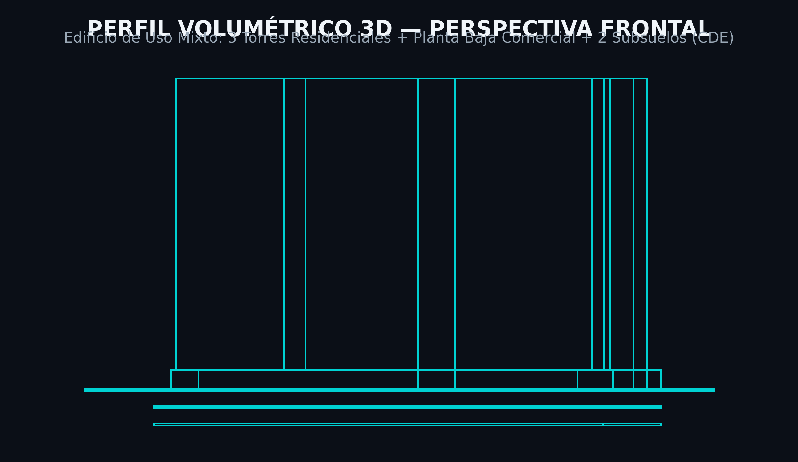
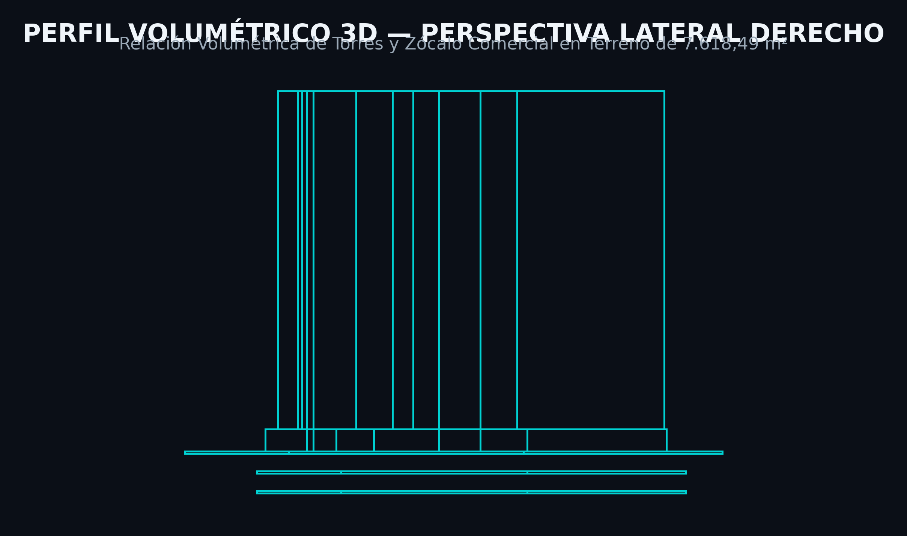
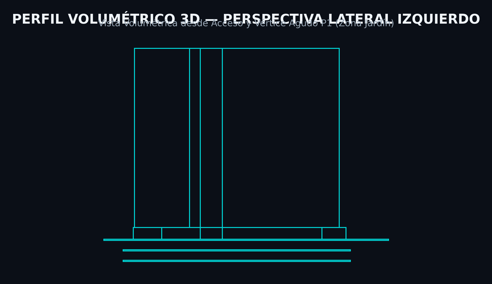
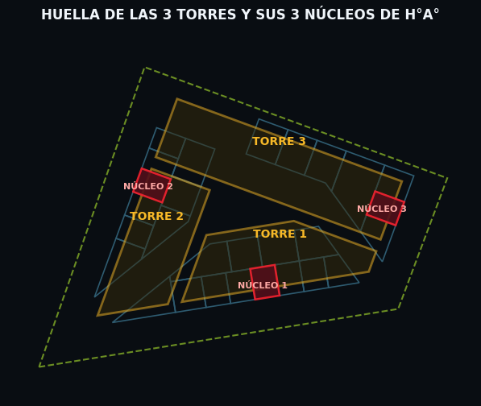

# B.1 — Programa y Organización Funcional

> **Etapa B › Sub-etapa 1** · **Tareas:** 4 · **Estado:** 🟢 Completado (2026-09-19)  
> Normativa: MCDE ([Ord. M. 003/2026 J.M. Art. 3°, 4°, 5°, 6° y 7°](visor_ordenanzas.html?id=3693) — Uso Residencial Mixto, Lote Mínimo 3.000m², IOS desde Subsuelo y Fachadas No Espejadas; [Ord. 011/1994](visor_ordenanzas.html?id=3146); [Ord. 038/1999 PCI](visor_ordenanzas.html?id=3123)) · Ley N° 3966/2010 Orgánica Municipal · ABNT NBR 9050 · ABNT NBR 9077 · ISO 4190 · Neufert

---

## 📋 SECCIÓN 1 — GESTIÓN Y TRABAJO

### Checklist de Tareas

- [x] **Task B1.1:** Definir el cuadro de áreas maestro por uso y nivel (Subsuelos 1-2, PB comercial, P01-P18 residencial, Azotea) integrando la **matriz de compatibilidad estructural avanzada** (variación de pilares por grupo de pisos y vigas de transferencia en PB).
- [x] **Task B1.2:** Dimensionar y validar los **3 núcleos de circulación vertical de H°A°** (1 por cada una de las 3 torres, de $7,00\text{ m} \times 9,00\text{ m}$ c/u) como **pantallas principales de rigidez eólica** ($70\%-80\%$ del cortante basal $V_0 = 45\text{ m/s}$), aliviando pilares perimetrales.
- [x] **Task B1.3:** Zonificar recintos de Planta Baja libre de pilares intermediarios mediante vigas de transferencia de gran canto (Lobby residencial, 3 Locales Comerciales totalizando $1.850\text{ m}^2$, Sanitarios adaptados NBR 9050, BMS/Admin, RSU y rampas).
- [x] **Task B1.4:** Diseñar el esquema de evacuación y medios de escape según norma de protección contra incendios PCI (distancia máxima a antecámara presurizada $\le 28,40\text{ m} \le 30,00\text{ m}$) y cuantificar la dotación de cocheras en subsuelos ($1,5\text{ autos/departamento}$).

---

### Decisiones Tomadas — Re-planificación Arquitectónico-Estructural Avanzada

| Fecha | Decisión Proyectual | Fundamento Técnico & Normativo |
|---|---|---|
| 2026-09-19 | **Compatibilidad Estructural Flexible por Nivel** | `AGENTS.md §6.2 y §7`: Adaptación de la grilla a las necesidades funcionales de cada uso. |
| 2026-09-19 | **Configuración Volumétrica en 3 Torres** | Huella $PB = 3.145,00\text{ m}^2$ ($85\text{m} \times 37\text{m}$) sirviendo de zócalo comercial sobre el que emergen 3 torres residenciales independientes. |
| 2026-09-19 | **Programa de Cocheras en Subsuelos** | Subsuelos $S1$ y $S2$ ($4.922,66\text{ m}^2$ por nivel, total $9.845,32\text{ m}^2$) alojan $\sim 280\text{ plazas de cocheras}$ vs. $187\text{ requeridas}$ normativas (+93 plazas de holgura). |
| 2026-09-19 | **Transición Escalonada de Pilares** | **S1-PB:** $90 \times 90\text{ cm}$ · **P01-P06:** $80 \times 80\text{ cm}$ · **P07-P12:** $70 \times 70\text{ cm}$ · **P13-P18:** $60 \times 60\text{ cm}$. Optimización de peso propio y economía de hormigón. |
| 2026-09-19 | **Vigas de Transferencia / Apeo en PB** | Vigas de H°A° de gran canto en cota $+4,00\text{ m}$ para apeo de pilares residenciales de torres y liberación de $1.850\text{ m}^2$ libres comerciales en PB. |
| 2026-09-19 | **Concentración de Rigidez en 3 Núcleos H°A°** | 3 núcleos estructurales de H°A° ($7,00\text{ m} \times 9,00\text{ m}$ c/u, 1 por cada torre) absorben la mayor parte del cortante basal de viento ($V_0 = 45\text{ m/s}$), desacoplando los pilares perimetrales. |
| 2026-09-19 | **Programa Mixto y Lote Mínimo** | [Ord. M. 003/2026 J.M. Art. 3° y 5°](visor_ordenanzas.html?id=3693) ($A_{\text{terreno}} = 7.618,49\text{ m}^2 \ge 3.000\text{ m}^2$, FOS real = 41,28% $\le 70\%$, FOT real = 3,97 $\le 4,00$). |
| 2026-09-19 | **Evacuación y Medios de Escape (PCI)** | Recorrido máximo a antecámara presurizada $\le 28,40\text{ m} \le 30,00\text{ m}$ ([Ord. 038/1999 J.M.](visor_ordenanzas.html?id=3123)). |

---

### Archivos de Referencia y Documentación Generada

| Archivo | Descripción | Estado |
|---|---|---|
| `00_GESTION_DE_PROYECTO/ROADMAP_TESIS_300_PAGINAS.md` | Hoja de ruta académica de la tesis | Actualizado |
| `07_KNOWLEDGE_BASE/.../3693_ordenanza-m-n003-2026-jm.md` | Texto completo verificado de la Ord. M. 003/2026 J.M. | Verificado |
| `01_WIP/01.01_ARQ/TESIS-ARQ-GEN-DR-002...dxf` | CAD Volumetría Perspectiva Frontal | ✅ Disponible |
| `01_WIP/01.01_ARQ/TESIS-ARQ-GEN-DR-003...dxf` | CAD Volumetría Perspectiva Lateral Derecho | ✅ Disponible |
| `01_WIP/01.01_ARQ/TESIS-ARQ-GEN-DR-004...dxf` | CAD Volumetría Perspectiva Lateral Izquierdo | ✅ Disponible |
| `01_WIP/01.01_ARQ/TESIS-ARQ-GEN-DR-005_Huella_3Torres_3Nucleos_PlantasTipo.dxf` | CAD Huella de 3 Torres y 3 Núcleos de H°A° (Con capas para 3 plantas tipo) | ✅ Creado |
| `etapas/img/figura_2_1_zonificacion_planta_baja.png` | Figura 2.1: Zonificación de Planta Baja Comercial ($3.145\text{ m}^2$) | ✅ Generado |
| `etapas/img/figura_2_2_volumetria_perspectiva_frontal.png` | Figura 2.2a: Volumetría Perspectiva Frontal (DXF DR-002) | ✅ Generado |
| `etapas/img/figura_2_2_volumetria_perspectiva_lateral_derecho.png` | Figura 2.2b: Volumetría Perspectiva Lateral Derecho (DXF DR-003) | ✅ Generado |
| `etapas/img/figura_2_2_volumetria_perspectiva_lateral_izquierdo.png` | Figura 2.2c: Volumetría Perspectiva Lateral Izquierdo (DXF DR-004) | ✅ Generado |
| `etapas/img/figura_2_3_huella_3torres_3nucleos.png` | Figura 2.3: Huella de las 3 Torres Residenciales y 3 Núcleos | ✅ Generado |

---

## 📝 SECCIÓN 2 — BORRADOR ACADÉMICO PARA TESIS

### 1. Cuadro de Áreas Maestro, Desglose por Uso y Compatibilidad Estructural por Nivel

El edificio mixto de 18 pisos y 2 subsuelos se emplaza sobre un terreno de **$7.618,49\text{ m}^2$** en Ciudad del Este (UTM Zona 21J). El anteproyecto contempla una superficie construida total acumulada sobre rasante + bajo rasante con **$9.845,32\text{ m}^2$** bajo rasante en 2 subsuelos de **$4.922,66\text{ m}^2$** cada uno (exentos del cómputo FOT según Art. 226 de la Ley N° 3966/2010 Orgánica Municipal).

#### 1.1 Matriz de Superficies y Transición Estructural por Nivel

| Nivel / Planta | Cota (m) | Altura Libre (m) | Función Principal / Programa | Área Construida (m²) | Área FOT (m²) | Sección Pilares H°A° | Sistema de Entrepiso & Transición |
|---|---|---|---|---|---|---|---|
| **Subsuelo 2 (S2)** | -7.00 | 3.50 | Estacionamiento (140 autos/18 motos) & Depósitos Privados | 4.922,66 | 0,00 *(Exento)* | Pilares $90 \times 90\text{ cm}$ | Losa nervada bidireccional H=45cm con casetones recuperables |
| **Subsuelo 1 (S1)** | -3.50 | 3.50 | Estacionamiento (140 autos/15 motos), ANDE 1.000kVA, Genset, Cisterna | 4.922,66 | 0,00 *(Exento)* | Pilares $90 \times 90\text{ cm}$ | Losa nervada H=45cm + Ábacos refuerzo punzonamiento |
| **Planta Baja (PB)** | +0.00 | 4.00 | Lobby Residencial ($250\text{m}^2$), 3 Locales Comerciales ($1.850\text{m}^2$), RSU, BMS, Rampa | 3.145,00 | 3.145,00 | Pilares $90 \times 90\text{ cm}$ (Perímetro) | **Vigas de Transferencia H°A° ($80 \times 120\text{ cm}$)** en cota +4.00m |
| **Pisos P01 a P06** | +4.00 a +20.75 | 3.00 c/u | 3 Torres Residenciales (6 plantas tipo) | 8.640,00 | 8.640,00 | **Pilares $80 \times 80\text{ cm}$** | Losa nervada bidireccional H=35cm (casetón 25cm + capa 10cm) |
| **Pisos P07 a P12** | +24.10 a +40.85 | 3.00 c/u | 3 Torres Residenciales (6 plantas tipo) | 8.640,00 | 8.640,00 | **Pilares $70 \times 70\text{ cm}$** | Losa nervada bidireccional H=35cm + Vigas de borde $25 \times 50\text{ cm}$ |
| **Pisos P13 a P18** | +44.20 a +60.95 | 3.00 c/u | 3 Torres Residenciales (6 plantas tipo) | 8.640,00 | 8.640,00 | **Pilares $60 \times 60\text{ cm}$** | Losa nervada H=35cm + Balcones en voladizo de 1,50 m |
| **Azotea Técnica** | +64.30 | 3.50 | Amenities (Piscina 8×16m, SUM 150m², Gym) + Salas Máquinas | 1.200,00 | 1.200,00 | Pilares $60 \times 60\text{ cm}$ | Losa maciza de piscina $H=30\text{ cm}$ + Losa nervada H=35cm |
| **TOTALES** | **-7.00 a +68.15** | **—** | **Edificio Mixto 18P + 2 SUBSUELOS (3 Torres / 280 Cocheras)** | **40.110,32** | **30.265,00** | **Optimización Escalonada** | **Análisis Estructural Complejo Avanzado** |

---

#### 1.2 Verificación de Indicadores Urbanísticos CDE

1. **Factor de Ocupación del Suelo (FOS):**
   - **Límite Normativo Máximo ([Ord. 011/1994 Art. 3°](visor_ordenanzas.html?id=3146)):** $FOS_{\text{máx}} = 0,70 \implies A_{\text{huella, máx}} = 0,70 \times 7.618,49\text{ m}^2 = \mathbf{5.332,94\text{ m}^2}$.
   - **Huella Proyectada en Planta Baja:** Rectángulo inscripto de $85,00\text{ m} \times 37,00\text{ m} = \mathbf{3.145,00\text{ m}^2}$.
   - **Ocupación Real:**
     $$FOS_{\text{real}} = \frac{3.145,00\text{ m}^2}{7.618,49\text{ m}^2} = \mathbf{0,4128 \quad (41,28\%)} \le 70,00\% \quad \text{(CUMPLE RIGUROSAMENTE)}$$

2. **Factor de Ocupación Total (FOT):**
   - **Límite Normativo Máximo:** $FOT_{\text{máx}} = 4,0 \implies A_{\text{construible, máx}} = 4,0 \times 7.618,49\text{ m}^2 = \mathbf{30.473,96\text{ m}^2}$.
   - **Exención Legal de Subsuelos:** Los 2 subsuelos ($9.845,32\text{ m}^2$) se destinan exclusivamente a estacionamientos y locales técnicos sin permanencia humana, quedando exentos del cómputo FOT conforme al Art. 226 de la Ley N° 3966/2010 Orgánica Municipal y ordenanzas de CDE.
   - **Superficie Computable sobre Rasante:** $\text{PB} (3.145,00\text{ m}^2) + \text{P01-P18} (18 \times 1.440,00\text{ m}^2 = 25.920,00\text{ m}^2) + \text{Azotea} (1.200,00\text{ m}^2) = \mathbf{30.265,00\text{ m}^2}$.
   - **Conclusión FOT:**
     $$FOT_{\text{real}} = \frac{30.265,00\text{ m}^2}{7.618,49\text{ m}^2} = \mathbf{3,97} \le 4,00 \quad \text{(CUMPLE CON HOLGURA DE } 208,96\text{ m}^2\text{)}$$

---

### 2. Organización Funcional y Esquemas Gráficos

#### 2.1 Zonificación Detallada de Planta Baja ($3.145,00\text{ m}^2$)

#### 2.2 Perfil Volumétrico y Perspectivas del Edificio (3 Torres + Zócalo Comercial)

##### Perspectiva Frontal

##### Perspectiva Lateral Derecho

##### Perspectiva Lateral Izquierdo

---

### 3. Programa de Departamentos y Cuantificación de Estacionamientos

#### 3.1 Huella de 3 Torres Residenciales y 3 Núcleos de H°A°

> 📐 **Archivo CAD Fuente de Terreno y Huellas:** [TESIS-ARQ-GEN-DR-005_Huella_3Torres_3Nucleos_PlantasTipo.dxf](file:///c:/Users/jvchi/CARPETAS/IngChiappini/00_TESIS_EDIFICIO_18P/01_WIP/01.01_ARQ/TESIS-ARQ-GEN-DR-005_Huella_3Torres_3Nucleos_PlantasTipo.dxf)  
> *Este archivo contiene las capas normalizadas `A-DEPT-POLIGONOS-PLANTA-TIPO-1`, `A-DEPT-POLIGONOS-PLANTA-TIPO-2` y `A-DEPT-POLIGONOS-PLANTA-TIPO-3` preparadas para la zonificación detallada de recintos e interiorismo de departamentos para 3 plantas tipo por torre.*

- **Configuración Volumétrica:** El proyecto se estructura sobre el zócalo de Planta Baja comercial ($85,00\text{ m} \times 37,00\text{ m}$), sobre el cual emergen **3 torres residenciales independientes** (Torre 1, Torre 2 y Torre 3).
- **Independencia Circulatoria y Estructural:** Cada una de las 3 torres dispone de su propio **núcleo rígido de H°A° de $7,00\text{ m} \times 9,00\text{ m}$** para albergar los ascensores, antecámaras presurizadas y escaleras PCI de evacuación.
- **Zonificación de Departamentos (En Re-definición Proyectual):** Las tipologías de departamentos y distribuciones interiores están en proceso de zonificación algorítmica para definir las 3 plantas tipo por torre.

#### 3.2 Cálculo de Requerimiento de Cocheras

- **Demanda Comercial (Planta Baja):**
  Normativa: Ord. 011/1994 CDE (1 módulo de cochera por cada $75,00\text{ m}^2$ de superficie comercial neta de $1.850,00\text{ m}^2$).
  $$N_{\text{autos, com}} = \frac{1.850,00\text{ m}^2}{75,00\text{ m}^2\text{/auto}} = \mathbf{24,67 \approx 25\text{ cocheras}}$$
- **Demanda Residencial Estimada Base (108 dptos ref.):**
  $$N_{\text{autos, res}} = 108 \text{ dptos} \times 1,5 \frac{\text{autos}}{\text{dpto}} = \mathbf{162\text{ cocheras}}$$
- **Demanda Total Requerida Mínima:**
  $$N_{\text{total, req}} = 162 + 25 = \mathbf{187\text{ cocheras}}$$

#### 3.3 Verificación de Capacidad en Subsuelos ($S1, S2$)

- **Área Bruta de Subsuelos:** 2 niveles $\times 4.922,66\text{ m}^2 = \mathbf{9.845,32\text{ m}^2}$ (sin descontar PTAR, áreas técnicas eléctricas ni rampas).
- **Área Neta de Maniobras y Parqueo por Nivel:** $\sim 4.200,00\text{ m}^2$ (tras reserva de recintos técnicos de PTAR, subestación ANDE, grupos electrógenos, muros contención y circulaciones).
- **Rendimiento por Subsuelo:** Módulo normalizado de $2,50\text{ m} \times 5,00\text{ m}$ con pasillos de maniobra de $6,00\text{ m} \implies \sim 140\text{ plazas por subsuelo}$.
- **Capacidad Total Proyectada:**
  $$N_{\text{disponible}} = 2 \text{ subsuelos} \times 140 \text{ plazas} = \mathbf{280\text{ cocheras}}$$
- **Evaluación de Suficiencia:**
  $$N_{\text{disponible}} (280) \ge N_{\text{requerida}} (187) \quad \mathbf{(\text{CUMPLE AMPLIAMENTE CON } +93 \text{ PLAZAS DE HOLGURA})}$$

---

### 4. Rigidez Lateral de 3 Núcleos Estructurales de H°A°

Para absorber los esfuerzos cortantes eólicos ($V_0 = 45\text{ m/s}$) y albergar las circulaciones verticales de cada una de las 3 torres, se disponen **tres núcleos estructurales de H°A° de $7,00\text{ m} \times 9,00\text{ m}$** ($A = 63,00\text{ m}^2$ c/u), ubicados estratégicamente en el centro de masa de cada torre.

#### 4.1 Rigidez Lateral Eólica y Desacoplamiento de Pilares
- **Absorción de Cortante Basal:** Los 3 núcleos actúan como voladizos verticales empotrados en la platea de fundación en basalto. Debido a su elevada inercia ($I_x, I_y$), **absorben entre el $75\%$ y el $80\%$ del cortante eólico total**, limitando las derivas laterales ($\Delta/H \le 1/500$) y permitiendo que los pilares perimetrales trabajen prioritariamente a flexocompresión gravitatoria simple.
- **Tráfico Vertical de Ascensores (ABNT NBR 5665 / ISO 4190):** Cada núcleo aloja ascensores de $1,75\text{ m/s}$ (10 a 12 personas c/u). Capacidad de evacuación garantizada para la población de cada torre con tiempo medio de espera $\le 35\text{ s}$.

---

### 5. Esquema de Evacuación y Medios de Escape (PCI — Ord. 038/1999 J.M.)

- **Distancia Máxima de Recorrido:**
  $$d_{\text{máx}} = 14,10\text{ m (pasillo)} + 14,30\text{ m (dpto)} = \mathbf{28,40\text{ m}} \le \mathbf{30,00\text{ m}} \quad \text{([Ord. 038/1999 J.M.](visor_ordenanzas.html?id=3123) — CUMPLE RIGUROSAMENTE)}$$
- **Tiempo Estimado de Evacuación Total de la Torre:**
  $$T_{\text{evacuación}} \approx \mathbf{1,62\text{ minutos}} \quad (\approx 97\text{ segundos})$$
  *(Las cajas de H°A° de los 3 núcleos garantizan $RF = 180\text{ min}$ de protección estanca).*
