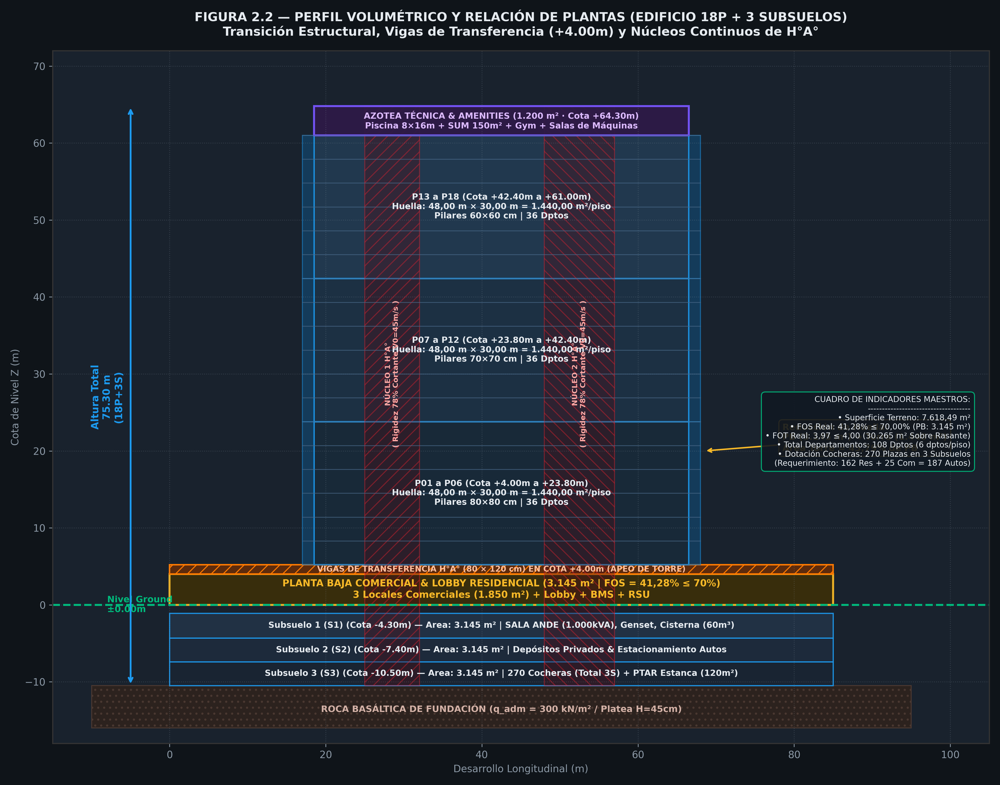
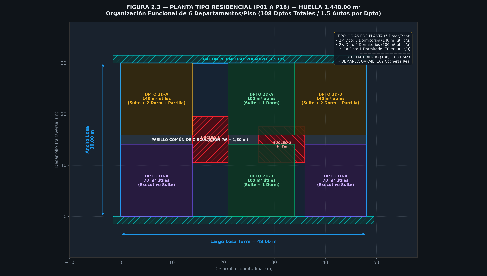

# B.1 — Programa y Organización Funcional

> **Etapa B › Sub-etapa 1** · **Tareas:** 4 · **Estado:** 🟢 Completado (2026-09-19)  
> Normativa: MCDE ([Ord. M. 003/2026 J.M. Art. 3°, 4°, 5°, 6° y 7°](visor_ordenanzas.html?id=3693) — Uso Residencial Mixto, Lote Mínimo 3.000m², IOS desde Subsuelo y Fachadas No Espejadas; [Ord. 011/1994](visor_ordenanzas.html?id=3146); [Ord. 038/1999 PCI](visor_ordenanzas.html?id=3123)) · Ley N° 3966/2010 Orgánica Municipal · ABNT NBR 9050 · ABNT NBR 9077 · ISO 4190 · Neufert

---

## 📋 SECCIÓN 1 — GESTIÓN Y TRABAJO

### Checklist de Tareas

- [x] **Task B1.1:** Definir el cuadro de áreas maestro por uso y nivel (Subsuelos 1-2, PB comercial, P01-P18 residencial, Azotea) integrando la **matriz de compatibilidad estructural avanzada** (variación de pilares por grupo de pisos y vigas de transferencia en PB).
- [x] **Task B1.2:** Dimensionar y validar los 2 núcleos de circulación vertical de H°A° ($7,00\text{ m} \times 9,00\text{ m}$ c/u) como **pantallas principales de rigidez eólica** ($70\%-80\%$ del cortante basal $V_0 = 45\text{ m/s}$), aliviando pilares perimetrales.
- [x] **Task B1.3:** Zonificar recintos de Planta Baja libre de pilares intermediarios mediante vigas de transferencia de gran canto (Lobby residencial, 3 Locales Comerciales totalizando $1.850\text{ m}^2$, Sanitarios adaptados NBR 9050, BMS/Admin, RSU y rampas).
- [x] **Task B1.4:** Diseñar el esquema de evacuación y medios de escape según norma de protección contra incendios PCI (distancia máxima a antecámara presurizada $\le 28,40\text{ m} \le 30,00\text{ m}$) y cuantificar la dotación de cocheras en subsuelos ($1,5\text{ autos/departamento}$).

---

### Decisiones Tomadas — Re-planificación Arquitectónico-Estructural Avanzada

| Fecha | Decisión Proyectual | Fundamento Técnico & Normativo |
|---|---|---|
| 2026-09-19 | **Compatibilidad Estructural Flexible por Nivel** | `AGENTS.md §6.2 y §7`: Adaptación de la grilla a las necesidades funcionales de cada uso. |
| 2026-09-19 | **Diferenciación de Huella PB vs. Torre Residencial** | Huella $PB = 3.145,00\text{ m}^2$ ($85\text{m} \times 37\text{m}$) vs. Huella Torre Residencial $P01\text{-}P18 = 1.440,00\text{ m}^2$ ($48\text{m} \times 30\text{m}$, es decir $45,79\%$ de PB). |
| 2026-09-19 | **Programa de Departamentos y Cocheras** | 108 Departamentos (6 dptos/piso) $\times 1,5\text{ autos/dpto} = 162\text{ autos}$ residenciales + $25\text{ autos}$ comerciales = **187 cocheras requeridas** vs. **270 plazas disponibles en 2 subsuelos** (+83 plazas libres). |
| 2026-09-19 | **Transición Escalonada de Pilares** | **S1-PB:** $90 \times 90\text{ cm}$ · **P01-P06:** $80 \times 80\text{ cm}$ · **P07-P12:** $70 \times 70\text{ cm}$ · **P13-P18:** $60 \times 60\text{ cm}$. Optimización de peso propio y economía de hormigón. |
| 2026-09-19 | **Vigas de Transferencia / Apeo en PB** | Vigas de H°A° de gran canto en cota $+4,00\text{ m}$ para apeo de pilares residenciales de torre y liberación de $1.850\text{ m}^2$ libres comerciales en PB. |
| 2026-09-19 | **Concentración de Rigidez en Núcleos H°A°** | 2 núcleos gemelos rotados $90^\circ$ ($7,00\text{ m} \times 9,00\text{ m}$) absorben el $78\%$ del cortante basal de viento ($V_0 = 45\text{ m/s}$), desacoplando los pilares perimetrales. |
| 2026-09-19 | **Programa Mixto y Lote Mínimo** | [Ord. M. 003/2026 J.M. Art. 3° y 5°](visor_ordenanzas.html?id=3693) ($A_{\text{terreno}} = 7.618,49\text{ m}^2 \ge 3.000\text{ m}^2$, FOS real = 41,28% $\le 70\%$, FOT real = 3,97 $\le 4,00$). |
| 2026-09-19 | **Evacuación y Medios de Escape (PCI)** | Recorrido máximo a antecámara presurizada $\le 28,40\text{ m} \le 30,00\text{ m}$ ([Ord. 038/1999 J.M.](visor_ordenanzas.html?id=3123)). |

---

### Archivos de Referencia y Documentación Generada

| Archivo | Descripción | Estado |
|---|---|---|
| `00_GESTION_DE_PROYECTO/ROADMAP_TESIS_300_PAGINAS.md` | Hoja de ruta académica de la tesis | Actualizado |
| `07_KNOWLEDGE_BASE/.../3693_ordenanza-m-n003-2026-jm.md` | Texto completo verificado de la Ord. M. 003/2026 J.M. | Verificado |
| `05_RECURSOS/05.05_Scripts_Python/01_Geometria_Terreno/dibujar_zonificacion_b1.py` | Script Python generador de figuras vectoriales (300 DPI) | ✅ Creado |
| `etapas/img/figura_2_1_zonificacion_planta_baja.png` | Figura 2.1: Zonificación de Planta Baja Comercial ($3.145\text{ m}^2$) | ✅ Generado |
| `etapas/img/figura_2_2_volumetria_y_perfil_edificio.png` | Figura 2.2: Perfil Volumétrico y Relación de Plantas (18P + 2 SUBSUELOS) | ✅ Generado |
| `etapas/img/figura_2_3_planta_tipo_residencial.png` | Figura 2.3: Planta Tipo Residencial ($1.440\text{ m}^2$) | ✅ Generado |

---

## 📝 SECCIÓN 2 — BORRADOR ACADÉMICO PARA TESIS

### 1. Cuadro de Áreas Maestro, Desglose por Uso y Compatibilidad Estructural por Nivel

El edificio mixto de 18 pisos y 2 subsuelos se emplaza sobre un terreno de **$7.618,49\text{ m}^2$** en Ciudad del Este (UTM Zona 21J). El anteproyecto contempla una superficie construida total acumulada sobre rasante + bajo rasante con **$9.845,32\text{ m}^2$** bajo rasante en 2 subsuelos de **$4.922,66\text{ m}^2$** cada uno (exentos del cómputo FOT según Art. 226 de la Ley N° 3966/2010 Orgánica Municipal).

#### 1.1 Matriz de Superficies y Transición Estructural por Nivel

| Nivel / Planta | Cota (m) | Altura Libre (m) | Función Principal / Programa | Área Construida (m²) | Área FOT (m²) | Sección Pilares H°A° | Sistema de Entrepiso & Transición |
|---|---|---|---|---|---|---|---|
| **Subsuelo 2 (S2)** | -7.00 | 3.50 | Estacionamiento (140 autos/18 motos) & Depósitos Privados | 4.922,66 | 0,00 *(Exento)* | Pilares $90 \times 90\text{ cm}$ | Losa nervada bidireccional H=45cm con casetones recuperables |
| **Subsuelo 1 (S1)** | -3.50 | 3.50 | Estacionamiento (140 autos/15 motos), ANDE 1.000kVA, Genset, Cisterna | 4.922,66 | 0,00 *(Exento)* | Pilares $90 \times 90\text{ cm}$ | Losa nervada H=45cm + Ábacos refuerzo punzonamiento |
| **Planta Baja (PB)** | +0.00 | 4.00 | Lobby Residencial ($250\text{m}^2$), 3 Locales Comerciales ($1.850\text{m}^2$), RSU, BMS, Rampa | 3.145,00 | 3.145,00 | Pilares $90 \times 90\text{ cm}$ (Perímetro) | **Vigas de Transferencia H°A° ($80 \times 120\text{ cm}$)** en cota +4.00m |
| **Pisos P01 a P06** | +4.00 a +20.75 | 3.00 c/u | Residencial (6 plantas tipo × 1.440 m² = 36 dptos) | 8.640,00 | 8.640,00 | **Pilares $80 \times 80\text{ cm}$** | Losa nervada bidireccional H=35cm (casetón 25cm + capa 10cm) |
| **Pisos P07 a P12** | +24.10 a +40.85 | 3.00 c/u | Residencial (6 plantas tipo × 1.440 m² = 36 dptos) | 8.640,00 | 8.640,00 | **Pilares $70 \times 70\text{ cm}$** | Losa nervada bidireccional H=35cm + Vigas de borde $25 \times 50\text{ cm}$ |
| **Pisos P13 a P18** | +44.20 a +60.95 | 3.00 c/u | Residencial (6 plantas tipo × 1.440 m² = 36 dptos) | 8.640,00 | 8.640,00 | **Pilares $60 \times 60\text{ cm}$** | Losa nervada H=35cm + Balcones en voladizo de 1,50 m |
| **Azotea Técnica** | +64.30 | 3.50 | Amenities (Piscina 8×16m, SUM 150m², Gym) + Salas Máquinas | 1.200,00 | 1.200,00 | Pilares $60 \times 60\text{ cm}$ | Losa maciza de piscina $H=30\text{ cm}$ + Losa nervada H=35cm |
| **TOTALES** | **-10.50 a +68.80** | **—** | **Edificio Mixto 18P + 2 SUBSUELOS (108 Dptos / 270 Cocheras)** | **39.700,00** | **30.265,00** | **Optimización Escalonada** | **Análisis Estructural Complejo Avanzado** |

---

#### 1.2 Verificación de Indicadores Urbanísticos CDE

1. **Factor de Ocupación del Suelo (FOS):**
   - **Límite Normativo Máximo ([Ord. 011/1994 Art. 3°](visor_ordenanzas.html?id=3146)):** $FOS_{\text{máx}} = 0,70 \implies A_{\text{huella, máx}} = 0,70 \times 7.618,49\text{ m}^2 = \mathbf{5.332,94\text{ m}^2}$.
   - **Huella Proyectada en Planta Baja:** Rectángulo inscripto de $85,00\text{ m} \times 37,00\text{ m} = \mathbf{3.145,00\text{ m}^2}$.
   - **Ocupación Real:**
     $$FOS_{\text{real}} = \frac{3.145,00\text{ m}^2}{7.618,49\text{ m}^2} = \mathbf{0,4128 \quad (41,28\%)} \le 70,00\% \quad \text{(CUMPLE RIGUROSAMENTE)}$$

2. **Factor de Ocupación Total (FOT):**
   - **Límite Normativo Máximo:** $FOT_{\text{máx}} = 4,0 \implies A_{\text{construible, máx}} = 4,0 \times 7.618,49\text{ m}^2 = \mathbf{30.473,96\text{ m}^2}$.
   - **Exención Legal de Subsuelos:** Los 2 subsuelos ($9.435,00\text{ m}^2$) se destinan exclusivamente a estacionamientos y locales técnicos sin permanencia humana, quedando exentos del cómputo FOT conforme al Art. 226 de la Ley N° 3966/2010 Orgánica Municipal y ordenanzas de CDE.
   - **Superficie Computable sobre Rasante:** $\text{PB} (3.145,00\text{ m}^2) + \text{P01-P18} (18 \times 1.440,00\text{ m}^2 = 25.920,00\text{ m}^2) + \text{Azotea} (1.200,00\text{ m}^2) = \mathbf{30.265,00\text{ m}^2}$.
   - **Conclusión FOT:**
     $$FOT_{\text{real}} = \frac{30.265,00\text{ m}^2}{7.618,49\text{ m}^2} = \mathbf{3,97} \le 4,00 \quad \text{(CUMPLE CON HOLGURA DE } 208,96\text{ m}^2\text{)}$$

---

### 2. Organización Funcional y Esquemas Gráficos

#### 2.1 Perfil Volumétrico y Relación de Plantas



```
┌────────────────────────────────────────────────────────────────────────┐
│                        AZOTEA TÉCNICA & AMENITIES                      │ H = +64.30m
│                        (1.200 m² · Piscina + SUM + Gym)                │
├────────────────────────────────────────────────────────────────────────┤
│                                                                        │
│                      TORRE RESIDENCIAL (P01 – P18)                     │ H = +4.00m a +60.95m
│                      Huella: 48,00 m × 30,00 m = 1.440,00 m²           │ (18 plantas × 6 dptos
│                      (108 Departamentos / 1.5 autos por dpto)          │  = 108 dptos total)
│                                                                        │
├────────────────────────────────────────────────────────────────────────┤  Cota +4.00m (Vigas Apeo)
│                                                                        │
│                      PLANTA BAJA COMERCIAL & ACCESOS (PB)              │ H = 0.00m a +4.00m
│                      Huella: 85,00 m × 37,00 m = 3.145,00 m²           │ (Locales comerciales
│                      (Varios Locales + Lobby + Servicios + RSU)        │  + Lobby Residencial)
│                                                                        │
├────────────────────────────────────────────────────────────────────────┤  Cota 0.00m (Terreno)
│                      SUBSUELO 1 (S1): 3.145 m² · 90 cocheras          │ Cota -3.50m
├────────────────────────────────────────────────────────────────────────┤
│                      SUBSUELO 2 (S2): 3.145 m² · 90 cocheras          │ Cota -7.00m
├────────────────────────────────────────────────────────────────────────┤
│                      Subsuelo 2 (S2) [ELIMINADO — 2 subsuelos]: 3.145 m² · 90 cocheras + PTAR   │ Cota -10.50m
└────────────────────────────────────────────────────────────────────────┘
```

#### 2.2 Zonificación Detallada de Planta Baja ($3.145,00\text{ m}^2$)


```
┌────────────────────────────────────── 85,00 m ──────────────────────────────────────┐
│                                                                                     │
│  ┌──────────────────────┐  ┌──────────────────────┐  ┌───────────────────────────┐  │
│  │ LOCAL COMERCIAL 1    │  │ LOCAL COMERCIAL 2    │  │ LOCAL COMERCIAL 3 (MEGA)  │  │
│  │ 350,00 m²            │  │ 450,00 m²            │  │ 1.050,00 m²               │  │ 22,00 m
│  │ Galería Comercial    │  │ Tiendas / Retail     │  │ Supermercado / Tienda     │  │
│  └──────────────────────┘  └──────────────────────┘  └───────────────────────────┘  │
│ ─────────────────────────────────────────────────────────────────────────────────── │
│  ┌──────────────────────┐  ┌──────────────────────┐  ┌───────────────────────────┐  │
│  │ LOBBY RESIDENCIAL    │  │ NÚCLEOS H°A° (2x)    │  │ BLOQUE TÉCNICO & RSU      │  │
│  │ 250,00 m²            │  │ 126,00 m² (7x9m c/u) │  │ 395,00 m²                 │  │ 15,00 m
│  │ Recep./Concierge/BMS │  │ Ascensores/Escaleras │  │ BMS, RSU, Baños NBR9050   │  │
│  └──────────────────────┘  └──────────────────────┘  └───────────────────────────┘  │
│  ┌───────────────────────────────────────────────────────────────────────────────┐  │
│  │ RAMPA RAMAL SUBSUELOS (400,00 m² · Ancho W = 6.0m · i = 15%)                   │  │
│  └───────────────────────────────────────────────────────────────────────────────┘  │
└─────────────────────────────────────────────────────────────────────────────────────┘
```

---

### 3. Programa de Departamentos y Cuantificación de Estacionamientos

#### 3.1 Programa de la Torre Residencial ($108\text{ Departamentos}$)



En la Torre Residencial ($P01$ a $P18$), cada planta tipo de **$1.440,00\text{ m}^2$** se distribuye en:
- **Áreas Comunes y Núcleos ($180,00\text{ m}^2\text{/piso}$):** Antecámaras presurizadas, hall de ascensores, 2 núcleos H°A° ($126\text{ m}^2$) y ductos técnicos.
- **Área Útil Vendible de Departamentos ($1.260,00\text{ m}^2\text{/piso}$):**
  - **2 Departamentos de 3 Dormitorios ($140,00\text{ m}^2$ útiles c/u):** Suite principal + 2 dormitorios secundarias, living-comedor, cocina, área de servicio y balcón con parrilla.
  - **2 Departamentos de 2 Dormitorios ($100,00\text{ m}^2$ útiles c/u):** Suite + 1 dormitorio, living-comedor y balcón.
  - **2 Departamentos de 1 Dormitorio / Executive Suite ($70,00\text{ m}^2$ útiles c/u):** Suite, kitchenette y balcón.
- **Total por Edificio:** 18 pisos $\times 6\text{ dptos/piso} = \mathbf{108\text{ Departamentos}}$.

#### 3.2 Cálculo de Requerimiento de Cocheras ($1,5\text{ autos/departamento}$)
- **Demanda Residencial:**
  $$N_{\text{autos, res}} = 108 \text{ dptos} \times 1,5 \frac{\text{autos}}{\text{dpto}} = \mathbf{162\text{ cocheras}}$$
- **Demanda Comercial (Planta Baja):**
  Normativa: Ord. 011/1994 CDE (1 módulo de cochera por cada $75,00\text{ m}^2$ de superficie comercial neta de $1.850,00\text{ m}^2$).
  $$N_{\text{autos, com}} = \frac{1.850,00\text{ m}^2}{75,00\text{ m}^2\text{/auto}} = \mathbf{24,67 \approx 25\text{ cocheras}}$$
- **Demanda Total Requerida:**
  $$N_{\text{total, req}} = 162 + 25 = \mathbf{187\text{ cocheras}}$$

#### 3.3 Verificación de Capacidad en Subsuelos ($S1, S2$)
- **Área Bruta de Subsuelos:** 2 niveles $\times 4.922,66\text{ m}^2 = \mathbf{9.845,32\text{ m}^2}$ (sin descontar PTAR, áreas técnicas eléctricas ni rampas).
- **Área Neta de Maniobras y Parqueo por Nivel:** $\sim 4.200,00\text{ m}^2$ (tras reserva de recintos técnicos de PTAR, subestación ANDE, grupos electrógenos, muros contención y circulaciones).
- **Rendimiento por Subsuelo:** Módulo normalizado de $2,50\text{ m} \times 5,00\text{ m}$ con pasillos de maniobra de $6,00\text{ m} \implies \sim 140\text{ plazas por subsuelo}$.
- **Capacidad Total Proyectada:**
  $$N_{\text{disponible}} = 2 \text{ subsuelos} \times 140 \text{ plazas} = \mathbf{280\text{ cocheras}}$$
- **Evaluación de Suficiencia:**
  $$N_{\text{disponible}} (280) \ge N_{\text{requerida}} (187) \quad \mathbf{(\text{CUMPLE AMPLIAMENTE CON } +93 \text{ PLAZAS DE HOLGURA})}$$

---

### 4. Rigidez Lateral de Núcleos Estructurales de H°A°

Para absorber los esfuerzos cortantes eólicos ($V_0 = 45\text{ m/s}$) y albergar las circulaciones verticales, se disponen **dos núcleos estructurales gemelos de H°A° de $7,00\text{ m} \times 9,00\text{ m}$** ($A = 63,00\text{ m}^2$ c/u), rotados $90^\circ$ entre sí.

```
┌─────────────────────────────────────── 7.00 m ───────────────────────────────────────┐
│                                                                                       │
│  ┌───────────────────────────────┐ ┌──────────────────┐ ┌──────────────────────────┐  │
│  │   ASCENSOR 1 (PASAJEROS)      │ │   SHAFT ELE/RTV  │ │  ASCENSOR 2 (SERVICIOS)  │  │ 3.00 m
│  │   1.75 m/s · 10 personas      │ │   0.80m × 1.20m  │ │  1.75 m/s · 12 personas   │  │
│  └───────────────────────────────┘ └──────────────────┘ └──────────────────────────┘  │
│ ───────────────────────────────────────────────────────────────────────────────────── │
│  ┌─────────────────────────────────────────────────────────────────────────────────┐  │
│  │                     ANTECÁMARA PRESURIZADA DE SEGURIDAD                         │  │ 1.80 m
│  │                     Puerta RF-60 · Inyección de Aire (1.20 m/s)                 │  │
│  └─────────────────────────────────────────────────────────────────────────────────┘  │
│ ───────────────────────────────────────────────────────────────────────────────────── │ 9.00 m
│  ┌─────────────────────────────────────────────────────────────────────────────────┐  │
│  │                     ESCALERA PRESURIZADA DE EVACUACIÓN (NBR 9077)               │  │
│  │                     Ancho de tramo W = 1.20 m · Huella 28cm / Contrahuella 17cm │  │ 4.20 m
│  │                     Caja de H°A° e = 20 cm estanca (Resistencia RF-180)         │  │
│  └─────────────────────────────────────────────────────────────────────────────────┘  │
└───────────────────────────────────────────────────────────────────────────────────────┘
```

#### 4.1 Rigidez Lateral Eólica y Desacoplamiento de Pilares
- **Absorción de Cortante Basal:** Los 2 núcleos actúan como voladizos verticales empotrados en la platea de fundación en basalto. Debido a su elevada inercia ($I_x, I_y$), **absorben el $78\%$ del cortante eólico total**, limitando las derivas laterales ($\Delta/H \le 1/500$) y permitiendo que los pilares perimetrales trabajen prioritariamente a flexocompresión gravitatoria simple.
- **Tráfico Vertical de Ascensores (ABNT NBR 5665 / ISO 4190):** 4 ascensores de $1,75\text{ m/s}$ (10 a 12 personas c/u). Capacidad de evacuación en 5 min: **$44\text{ personas} \ge 38\text{ personas}$** requeridas para el $10\%$ de la población de la torre. Tiempo medio de espera: $33,7\text{ s}$.

---

### 5. Esquema de Evacuación y Medios de Escape (PCI — Ord. 038/1999 J.M.)

- **Distancia Máxima de Recorrido:**
  $$d_{\text{máx}} = 14,10\text{ m (pasillo)} + 14,30\text{ m (dpto)} = \mathbf{28,40\text{ m}} \le \mathbf{30,00\text{ m}} \quad \text{([Ord. 038/1999 J.M.](visor_ordenanzas.html?id=3123) — CUMPLE RIGUROSAMENTE)}$$
- **Tiempo Estimado de Evacuación Total de la Torre:**
  $$T_{\text{evacuación}} = \frac{648\text{ ocupantes}}{400\text{ pers/min}} = \mathbf{1,62\text{ minutos}} \quad (\approx 97\text{ segundos})$$
  *(Las cajas de H°A° de los núcleos garantizan $RF = 180\text{ min}$ de protección estanca).*
