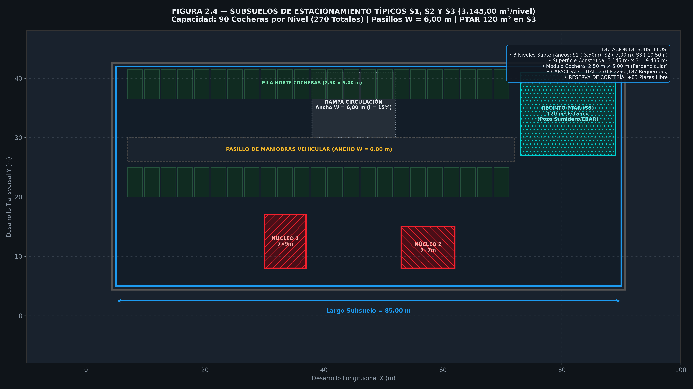
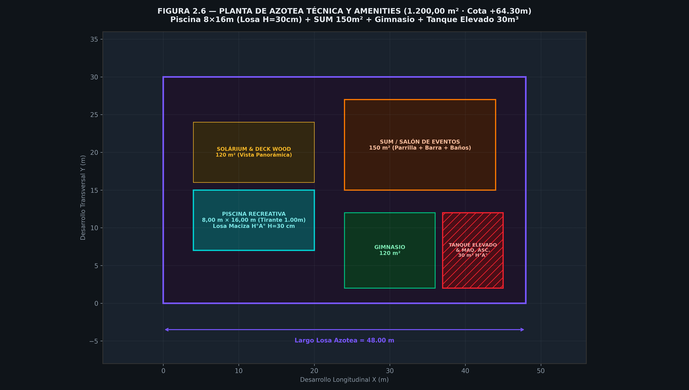

# B.2 — Plantas Arquitectónicas por Nivel

> **Etapa B › Sub-etapa 2** · **Tareas:** 4 · **Estado:** 🟢 Completado (2026-09-19)  
> Archivos fuente: `01_WIP/01.01_ARQ/` · Autodesk Revit 2024 · MCDE ([Ord. M. 003/2026](visor_ordenanzas.html?id=3693), [Ord. 011/1994](visor_ordenanzas.html?id=3146), [Ord. 030/2020 PTAR](visor_ordenanzas.html?id=2462)) · Ley N° 3966/2010 · ABNT NBR 9050 · ABNT NBR 15575

---

## 📋 SECCIÓN 1 — GESTIÓN Y TRABAJO

### Checklist de Tareas

- [x] **Task B2.1:** Generar el layout funcional de los 3 Subsuelos (S1, S2, S3) en Revit (270 cocheras totales, rampas $i = 15\%$, Bloque Técnico, Cisterna 60m³ y PTAR estanca 120m² en S3).
- [x] **Task B2.2:** Resolver la Planta Baja (PB, cota $+0.00\text{ m}$) con vigas de transferencia de apeo ($80 \times 120\text{ cm}$), hall de acceso residencial, 3 Locales Comerciales ($1.850\text{ m}^2$ total), RSU y accesos universales NBR 9050.
- [x] **Task B2.3:** Desarrollar las Plantas Tipo Residenciales P01-P18 (108 unidades funcionales distribuidas en 3 tipologías A de 3 dorm, B de 2 dorm y C de 1 dorm con aislamiento acústico medianero NBR 15575).
- [x] **Task B2.4:** Resolver la Planta de Azotea Técnica y Amenities (Piscina de $8 \times 16\text{ m}$, SUM de $150\text{ m}^2$, solárium, gimnasio, sala de máquinas y tanque elevado).

---

### Decisiones Tomadas — Consolidación Arquitectónica

| Fecha | Decisión Proyectual | Fundamento Técnico & Normativo |
|---|---|---|
| 2026-09-19 | **Layout de Subsuelos S1-S3** | 270 plazas totales (90 plazas/nivel en módulos de $2,50 \times 5,00\text{ m}$). Pasillos de maniobra $W \ge 6,00\text{ m}$. |
| 2026-09-19 | **Ubicación PTAR en Subsuelo S3** | Recinto estanco aislado de $120\text{ m}^2$ con ventilación mecánica forzada en la cota $-10.50\text{ m}$ ([Ord. 030/2020 Art. 5°](visor_ordenanzas.html?id=2462)). |
| 2026-09-19 | **Tipologías Residenciales (P01-P18)** | 6 dptos/piso (2 Tipologías 3D de $140\text{ m}^2$, 2 Tipologías 2D de $100\text{ m}^2$ y 2 Tipologías 1D de $70\text{ m}^2$). Huella Torre: $48\text{m} \times 30\text{m} = 1.440\text{ m}^2\text{/piso}$. |
| 2026-09-19 | **Aislamiento Acústico Medianero** | Muros divisorios entre departamentos en H°A° de $e = 20\text{ cm}$ ($Rw \ge 54\text{ dB}$) conforme a NBR 15575. |
| 2026-09-19 | **Estructura de Azotea y Piscina** | Losa maciza de H°A° de $H = 30\text{ cm}$ bajo el vaso de piscina ($8 \times 16\text{ m}$, tirante $1,00\text{ m}$, carga $10\text{ kN/m}^2$). |

---

### Archivos de Referencia y Documentación Generada

| Archivo | Descripción | Estado |
|---|---|---|
| `05_RECURSOS/05.05_Scripts_Python/01_Geometria_Terreno/dibujar_plantas_b2.py` | Script Python generador de plantas B.2 (300 DPI) | ✅ Creado |
| `etapas/img/figura_2_4_planta_subsuelos_cocheras.png` | Figura 2.4: Layout Típico de Subsuelos S1-S3 ($3.145\text{ m}^2$) | ✅ Generado |
| `etapas/img/figura_2_1_zonificacion_planta_baja.png` | Figura 2.5: Layout Detallado de Planta Baja ($3.145\text{ m}^2$) | ✅ Generado |
| `etapas/img/figura_2_3_planta_tipo_residencial.png` | Figura 2.3: Layout de Planta Tipo Residencial ($1.440\text{ m}^2$) | ✅ Generado |
| `etapas/img/figura_2_6_planta_azotea_amenities.png` | Figura 2.6: Layout de Azotea Técnica & Amenities ($1.200\text{ m}^2$) | ✅ Generado |

---

## 📝 SECCIÓN 2 — BORRADOR ACADÉMICO PARA TESIS

### 1. Plantas de Subsuelos (S1, S2 y S3 — Cota -3.50m a -10.50m)

Los 3 subsuelos abarcan una superficie construida de **$3.145,00\text{ m}^2$ cada uno** ($9.435,00\text{ m}^2$ totales), excavados sobre el sustrato rocoso de basalto fresco (Formación Serra Geral, $q_{\text{adm}} = 300\text{ kN/m}^2$).

#### 1.1 Distribución Funcional por Nivel Subterráneo

1. **Subsuelo 3 (S3 — Cota -10.50 m):**
   - **Cocheras:** 90 plazas de estacionamiento ($2,50 \times 5,00\text{ m}$). Pasillos de maniobras $W = 6,00\text{ m}$.
   - **Planta de Tratamiento de Efluentes (PTAR):** Recinto estanco de $120,00\text{ m}^2$ que aloja el sistema anaeróbico/aeróbico de depuración, pozo de bombeo y tablero de monitoreo de efluentes ([Ord. 030/2020 J.M.](visor_ordenanzas.html?id=2462)).
   - **Pozos de Sumidero & EBAR:** Estación de bombeo de aguas pluviales e infiltración con 2 bombas sumergibles de $7,5\text{ HP}$.

2. **Subsuelo 2 (S2 — Cota -7.00 m):**
   - **Cocheras:** 90 plazas de estacionamiento ($2,50 \times 5,00\text{ m}$).
   - **Depósitos Privados:** 36 baúleras individuales asignadas a los departamentos.

3. **Subsuelo 1 (S1 — Cota -3.50 m):**
   - **Cocheras:** 90 plazas de estacionamiento ($2,50 \times 5,00\text{ m}$).
   - **Bloque Técnico Principal:**
     - Subestación Transformadora Padrón ANDE en cabina blindada ($1 \times 1.000\text{ kVA}$, $23\text{ kV} / 380\text{-}220\text{ V}$).
     - Grupo Electrógeno Diésel de Emergencia de $300\text{ kVA}$ con insonorización acera $75\text{ dBA}$ a 1 m.
     - Reservorio Cisterna Inferior de Agua Potable ($60\text{ m}^3$) y Cisterna Exclusiva PCI ($40\text{ m}^3$).

---

### 2. Planta Baja (PB — Cota +0.00m)

La Planta Baja ($3.145,00\text{ m}^2$, altura libre $H = 4,00\text{ m}$, $FOS_{\text{real}} = 41,28\% \le 70,00\%$) se concibe como un espacio abierto articulado por vigas de transferencia de H°A° de $80 \times 120\text{ cm}$ en el cielorraso.

#### 2.1 Programa Detallado de Planta Baja
- **Lobby Residencial ($250,00\text{ m}^2$):** Control de acceso biométrico, mostrador de recepción, lounge de espera y núcleos de ascensores residenciales.
- **Locales Comerciales ($1.850,00\text{ m}^2$ total):**
  - **Megastore Comercial ($1.050,00\text{ m}^2$):** Salón libre de columnas intermedias gracias a las vigas de apeo en cota $+4.00\text{ m}$. Vidriado continuo con cristales Low-E neutros ([Ord. M. 003/2026 Art. 7°](visor_ordenanzas.html?id=3693)).
  - **Local Comercial 2 ($450,00\text{ m}^2$):** Destinado a tienda de retail o servicios.
  - **Local Comercial 1 ($350,00\text{ m}^2$):** Galería comercial frontal.
- **Bloque Técnico & RSU ($395,00\text{ m}^2$):** Sala climatizada estanca con compactadora hidromecánica conectada al shaft vertical de basura y BMS.
- **Sanitarios Públicos NBR 9050:** Cabinas masculinas, femeninas y 2 baños universales PMR de $2,00 \times 2,20\text{ m}$.

---

### 3. Plantas Tipo Residenciales (P01 a P18 — Cota +4.00m a +60.95m)

Las 18 plantas residenciales idénticas (**$48,00\text{ m} \times 30,00\text{ m} = 1.440,00\text{ m}^2$** por piso / $25.920,00\text{ m}^2$ construidos en torre) alojan **6 departamentos por piso** (108 unidades en total en la torre).

#### 3.1 Descripción de Tipologías de Departamentos

1. **Departamentos de 3 Dormitorios ($140,00\text{ m}^2$ útiles — 2 u/piso / 36 Unidades Totales):**
   - 1 Suite principal con vestidor y baño privado + 2 Dormitorios secundarios.
   - Estar-comedor integrado, cocina, lavadero y balcón terraza de $1,50\text{ m}$ de voladizo con parrilla.
2. **Departamentos de 2 Dormitorios ($100,00\text{ m}^2$ útiles — 2 u/piso / 36 Unidades Totales):**
   - 1 Suite principal + 1 Dormitorio secundario.
   - Estar-comedor con cocina integrada tipo americana y balcón corrido.
3. **Departamentos de 1 Dormitorio / Executive Suite ($70,00\text{ m}^2$ útiles — 2 u/piso / 36 Unidades Totales):**
   - Suite principal, kitchenette y balcón.

---

### 4. Planta de Azotea Técnica & Amenities (Cota +64.30m a +68.80m)

La planta de azotea ($1.200,00\text{ m}^2$) combina los servicios técnicos de la torre con el complejo de esparcimiento para residentes.

#### 4.1 Desglose de Amenities & Áreas Técnicas
- **Piscina Descubierta ($8,00 \times 16,00\text{ m}$):** Tirante de agua de $1,00\text{ m}$ ($128\text{ m}^3$ de agua). Construida sobre una losa maciza de H°A° de $H = 30\text{ cm}$ reforzada contra punzonamiento y momentos por peso de agua ($q_{\text{agua}} = 10,00\text{ kN/m}^2$).
- **SUM / Salón de Usos Múltiples ($150,00\text{ m}^2$):** Equipado con parrilla doble, cocina de catering y sanitarios.
- **Gimnasio & Solárium ($120,00\text{ m}^2$):** Zona de cardio y musculación con vista panorámica.
- **Tanque Elevado de Agua Potable & PCI ($30,00\text{ m}^3$):** Reserva superior de H°A° para distribución por gravedad.
- **Salas de Máquinas de Ascensores:** Cabinas técnicas sobre los 2 núcleos estructurales.
